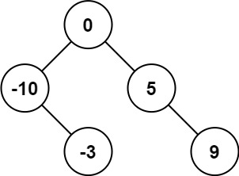

### 108. 将有序数组转换为二叉搜索树

>给你一个整数数组 nums ，其中元素已经按 升序 排列，请你将其转换为一棵 高度平衡 二叉搜索树。
>
>高度平衡 二叉树是一棵满足「每个节点的左右两个子树的高度差的绝对值不超过 1 」的二叉树。
***
>示例 1：  
>  
>输入：nums = [-10,-3,0,5,9]  
>输出：[0,-3,9,-10,null,5]  
>解释：[0,-10,5,null,-3,null,9] 也将被视为正确答案：  
>  

>示例 2：  
>  
>输入：nums = [1,3]  
>输出：[3,1]  
>解释：[1,3] 和 [3,1] 都是高度平衡二叉搜索树。  
***
```java
class Solution {    
    public TreeNode sortedArrayToBST(int[] nums) {
        return traversal(nums, 0, nums.length);
    }

    private TreeNode traversal(int[] nums, int left, int right) {
        if (left >= right) {
            return null;
        }
        if (right - left == 1) {
            return new TreeNode(nums[left]);
        }
        int mid = left + ((right - left) >> 1);
        TreeNode root = new TreeNode(nums[mid]);
        root.left = traversal(nums, left, mid);
        root.right = traversal(nums, mid + 1, right);
        return root;
    }
}
```
