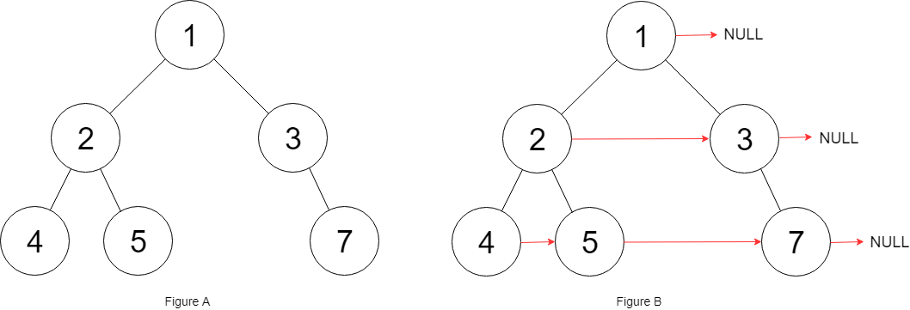

### 117. 填充每个节点的下一个右侧节点指针 II

>给定一个二叉树

    struct Node {
      int val;
      Node *left;
      Node *right;
      Node *next;
    }

>填充它的每个 next 指针，让这个指针指向其下一个右侧节点。如果找不到下一个右侧节点，则将 next 指针设置为 NULL。  
>初始状态下，所有 next 指针都被设置为 NULL。  
>
>进阶：  

    你只能使用常量级额外空间。
    使用递归解题也符合要求，本题中递归程序占用的栈空间不算做额外的空间复杂度。
***
>示例：  
>  
>输入：root = [1,2,3,4,5,null,7]  
>输出：[1,#,2,3,#,4,5,7,#]  
>解释：给定二叉树如图 A 所示，你的函数应该填充它的每个 next 指针，以指向其下一个右侧节点，如图 B 所示。序列化输出按层序遍历顺序（由 next 指针连接），'#' 表示每层的末尾。  
***
```java
class Solution {
    public Node connect(Node root) {
        Queue<Node> queue = new LinkedList<>();
        if (root != null) {
            queue.offer(root);
        }
        while (!queue.isEmpty()) {
            int len = queue.size();
            Node node = null;
            Node nodePre = null;
            
            for (int i = 0; i < len; i++) {
                if(i == 0){
                    //取出本层第一个节点
                    nodePre = queue.poll();
                    node = nodePre;
                }else{
                    node = queue.poll();
                    //本层前一个节点指向当前节点
                    nodePre.next = node;
                    nodePre = nodePre.next;
                }
                if (node.left != null) {
                    queue.offer(node.left);
                }
                if (node.right != null) {
                    queue.offer(node.right);
                }
            }
            //本层最后一个节点指向 null
            nodePre.next = null;
        }
        return root;
    }
}
```