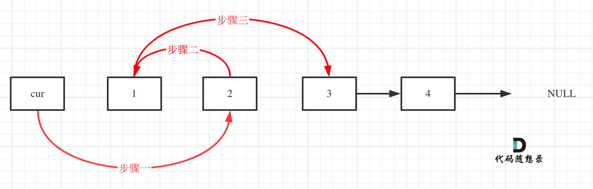

### 24. 两两交换链表中的节点

>给定一个链表，两两交换其中相邻的节点，并返回交换后的链表。   
>你不能只是单纯的改变节点内部的值，而是需要实际的进行节点交换。   
***
>示例 1：   
   
>输入：head = [1,2,3,4]   
>输出：[2,1,4,3]   

>示例 2：   
>输入：head = []   
>输出：[]   

>示例 3：   
>输入：head = [1]   
>输出：[1]   
***
   
```java
/**
 * Definition for singly-linked list.
 * public class ListNode {
 *     int val;
 *     ListNode next;
 *     ListNode() {}
 *     ListNode(int val) { this.val = val; }
 *     ListNode(int val, ListNode next) { this.val = val; this.next = next; }
 * }
 */
class Solution {
    public ListNode swapPairs(ListNode head) {
        //创建虚拟头结点
        ListNode dummy = new ListNode(-1, head);
        ListNode pre = dummy;
        while (pre.next != null && pre.next.next != null) {
            ListNode tmp = head.next.next;
            //pre -> head.next
            pre.next = head.next;
            //head.next -> head
            head.next.next = head;
            //head -> tmp
            head.next = tmp;
            //步进
            pre = head;
            head = head.next;
        }
        return dummy.next;
    }
}
```