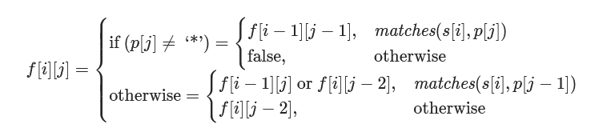

### 10. 正则表达式匹配
    
>给你一个字符串 s 和一个字符规律 p，请你来实现一个支持 '.' 和 '*' 的正则表达式匹配。   
>   *  '.' 匹配任意单个字符   
>   *  '*' 匹配零个或多个前面的那一个元素   

>所谓匹配，是要涵盖 整个 字符串 s的，而不是部分字符串。   
***

>示例 1：   
输入：s = "aa" p = "a"   
输出：false   
解释："a" 无法匹配 "aa" 整个字符串。   

>示例 2:   
输入：s = "aa" p = "a*"   
输出：true   
解释：因为 '*' 代表可以匹配零个或多个前面的那一个元素, 在这里前面的元素就是 'a'。因此，字符串 "aa" 可被视为 'a' 重复了一次。   

>示例 3：   
输入：s = "ab" p = ".*"   
输出：true   
解释：".*" 表示可匹配零个或多个（'*'）任意字符（'.'）。   

>示例 4：   
输入：s = "aab" p = "c*a*b"   
输出：true   
解释：因为 '*' 表示零个或多个，这里 'c' 为 0 个, 'a' 被重复一次。因此可以匹配字符串 "aab"。   

>示例 5：   
输入：s = "mississippi" p = "mis*is*p*."   
输出：false   

***
>字符dp[ i ][ j ]匹配时有三种情形：  
>*  英文字符匹配：  
>     * 直接比较
>         * 匹配成功：= dp[ i - 1 ][ j - 1 ]
>         * 匹配失败：= F
>*  ' . '匹配
>     * 它可以匹配任意单个字符，永远匹配成功
>*  ' * '匹配
>     * 对 p 的第 j − 1 个字符匹配任意自然数次。   
>         * 在匹配 0 次的情况下:  
>           f[ i ][ j ]=f[ i ][ j − 2 ]   
>           也就是我们「浪费」了一个字符 + 星号的组合，没有匹配任何 s 中的字符。  
>         * 在匹配多次的情况下，  
>             *  匹配 s 末尾的一个字符，将该字符扔掉，而该组合还可以继续进行匹配；
>             *  不匹配字符，将该组合扔掉，不再进行匹配。

>最后的状态转移方程如下：  


***

|i\j|0|c|*|a|*|b|
|:----:|----|----|----|----|----|----|
|0|T|F|T|F|T|F|
|a|F|F|F|T|**T**|F|
|a|F|F|F|F|T|F|
|b|F|F|F|F|F|T|


```java
class Solution {
    public boolean isMatch(String s, String p) {
        boolean[][] dp = new boolean[s.length()+1][p.length()+1];
        dp[0][0] = true;
        for(int i = 0 ;i <= s.length(); i++) {
            for (int j = 1; j <= p.length(); j++) {
                if (p.charAt(j - 1) == '*') {
                    // 遇到 '*' 时
                    // 先跳过 '*' 服务的字符匹配情况，判断再前一个的状态
                    dp[i][j] = dp[i][j - 2];
                    if (matches(s, p, i, j - 1)) {
                        //判断 '*' 前一个字符是否匹配
                        // '*' 前一个字符匹配时， '?''*' 增加了匹配能力，需要进一步判断当前匹配状态
                        dp[i][j] = dp[i][j] || dp[i - 1][j];

                    }
                } else {
                    //不是 '*' 时
                    // 判断当前字符是否匹配
                    if (matches(s, p, i, j)) {
                        //匹配时，获取(i - 1,j - 1)的状态
                        dp[i][j] = dp[i - 1][j - 1];
                    }
                }
            }
        }
        return dp[s.length()][p.length()];
    }
    
    public boolean matches(String s, String p, int i, int j) {
        if (i == 0) {
            //i为零时，单字符匹配 "" ，永远匹配失败
            return false;
        }
        if (p.charAt(j - 1) == '.') {
            //'.' 可以匹配任意单个字符，永远匹配成功
            return true;
        }
        //其他情况下，字符直接比较
        return s.charAt(i - 1) == p.charAt(j - 1);
    }
}
```
