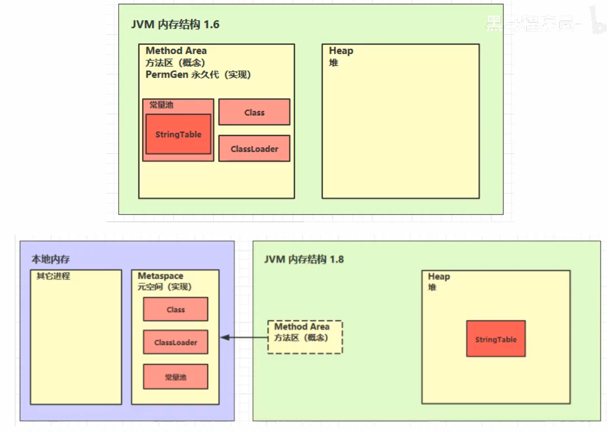

# 1_内存结构

1. 程序计数器
2. 虚拟机栈
3. 本地方法栈
4. 堆
5. 方法区

|线程私有|线程共享|
|:----|:----|
|程序计数器、虚拟机栈、本地方法栈|堆、方法区|

## 1.程序计数器
### 1.1 定义
Program Counter Register 程序计数器（寄存器）

* 作用：记住下一条 JVM 指令的执行地址
* 特点：
    * 是线程私有的
    * 不会存在内存溢出

### 1.2 作用
```
0: getstatic #20            // PrintStream out = System.out;
3: astore_1                 // --
4: aload_1                  // out.println(1);
5: iconst_1                 // --
6: invokevirtual #26        // --
9: aload_1                  // out.println(2);
10: iconst_2                // --
11: invokevirtual #26       // --
14: aload_1                 // out.println(3);
15: iconst_3                // --
16: invokevirtual #26       // --
19: aload_1                 // out.println(4);
20: iconst_4                // --
21: invokevirtual #26       // --
24: aload_1                 // out.println(5);
25: iconst_5                // --
26: invokevirtual #26       // --
29: return
```

## 2.虚拟机栈
### 2.1 定义
Java Virtual Machine Stacks （Java 虚拟机栈）
* 每个线程运行时所需要的内存，称为虚拟机栈
* 每个栈由多个栈帧（Frame）组成，对应着每次方法调用时所占用的内存
* 每个线程只能有一个活动栈帧，对应着当前正在执行的那个方法

问题辨析：

1. 垃圾回收是否涉及栈内存  
    栈帧内存每次方法调用结束后都自己弹出栈，自动地就被回收掉。
2. 栈内存分配越大越好嘛？  
    物理内存的大小是一定的。栈越大，线程数反而变少，不会增强运行的效率。使用系统默认栈内存即可。
3. 方法内的局部变量是否线程安全？  
    * 如果方法内局部变量没有逃离方法的作用访问，它是线程安全的
    * 如果是局部变量引用了对象，并逃离方法的作用范围，需要考虑线程安全
    
### 2.2 栈内存溢出
java.lang.StackOverflowError
* 栈帧过多导致栈内存溢出  
    * 方法的递归调用中结束条件错误
    * -Xss256k
* 栈帧过大导致栈内存溢出

### 2.3 线程运行诊断
案例1：cpu 占用过多

定位
* 用 top 定位哪个进程对 cpu 的占用过高
* ps H -eo pid,tid,%cpu | grep 进程id （用 ps 命令进一步定位是哪个线程引起的 cpu 占用过高）
* jstack 进程id
    * 可以根据线程 id 找到有问题的线程，进一步定位到问题代码的源码行号

案例2：程序运行很长时间没有结果

## 3.本地方法栈
Native Method Stacks
```java
protected native Object clone() throws CloneNotSupportedException;
```

## 4.堆
### 4.1 定义
Heap 堆
* 通过 new 关键字，创建的对象都会使用堆内存

特点
* 它是线程共享的，堆中的对象都需要考虑线程安全问题
* 有垃圾回收机制

### 4.2 堆内存溢出
* java.lang.OutOfMemoryError: Java heap space
    * -Xmx8m

### 4.3 堆内存诊断
1. jps 工具
    * 查看当前系统中有哪些 java 进程
2. jmap 工具
    * 查看堆内存占用情况： jmap - heap 进程id
3. jconsole 工具
    * 图形界面的、多功能的检测工具，可以连续检测

案例
* 垃圾回收后，内存占用仍然很高？  
可视化虚拟机：jvisualvm  
“堆Dump” 抓取当前快照，检查大小最大的对象进行进一步分析

## 5.方法区
### 5.1 定义
* 所有 Java 虚拟机线程共享的区
* 存储了与类的结构相关的信息，包括：运行时常量池、类的成员变量、方法数据以及成员方法和构造器方法
* 在虚拟机启动时被创建，逻辑上是堆的组成部分
* 如果申请内存时发现不足，抛出 OutOfMemoryError

### 5.2 组成


### 5.3 方法区内存溢出
* 1.8 以前会导致永久代内存溢出 
    * PermGen space
    * -XX:MaxPermSize=8m
* 1.8 以后会导致元空间内存溢出
    * Metaspace
    * -XX:MaxMetaspaceSize=8m

场景
* spring
    * cglib 生成代理类
* mybatis
    * cglib 产生 mapper 接口实现类

### 5.4 运行时常量池
* 常量池，就是一张表，虚拟机指令根据这张常量表找到要执行的类名、方法名、参数类型、字面量等信息
* 运行时常量池，常量池是 *.class 文件中的，当该类被加载，它的常量池信息就会放入运行时常量池，并把里面的符号地址变为真实地址

### 5.5 串池(StringTable)
面试题
```java
String s1 = "a";
String s2 = "b";
String s3 = "a" + "b";
String s4 = s1 + s2;
String s5 = "ab";
String s6 = s4.intern();

// 问
System.out.println(s3 == s4);
// false 
// 因为 s3 是串池中的一个字符串对象，s4 是一个新的字符串对象，在堆里面。所以他们是两个对象。

System.out.println(s3 == s5);
// true
// 定义 s5 时，要去常量池中找 “ab” ，在串池中发现已经有了，所以不会创建新的，而是沿用。所以他们是同一个对象。
// 这是 javac 编译期间的优化，结果已经在编译期间确定了

System.out.println(s3 == s6);
// true
// 串池中已经有 “ab” 了，intern 把 s4 尝试放入时不会再放入，会把串池中的对象返回。所以他们是同一个对象。


String x2 = new String("c") + new String("d");
String x1 = "cd";
x2.intern();

// 问，如果调换了【最后两行代码】的位置呢，如果是jdk1.6呢
System.out.println(x1 == x2);
// 原始情况
// false
// x2 在堆中，x1 在串池，所以不是一个对象

// 调换了【最后两行代码】的位置
// true
// x2 先入串池了，x1 发现串池中已经有 “cd” 了，不会创建新的。所以是一个对象

// jdk1.6
// false
// x2 的副本入串池，和堆中的是两个不同的对象，x1 得到的是串池中的副本。所以不是一个对象
```

StringTable 特性
* 常量池中的字符串仅是符号，第一次用到时才变为对象
* 利用串池的机制，来避免重复创建字符串对象
* 字符串变量拼接的原理是 StringBuilder （1.8）
* 字符串常量拼接的原理是编译期优化
* 可以使用 intern 方法，主动将串池中还没有的字符串对象放入串池
    * 1.8 将这个字符串对象尝试放入串池，如果有则并不会放入，如果没有则放入串池， 会把串池中的对象返回
    * 1.6 将这个字符串对象尝试放入串池，如果有则并不会放入，如果没有会把**此对象复制一份放入串池**，会把串池中的对象返回

### 5.6 StringTable 的位置
* 1.6 时是常量池的一部分，随常量池存储在永久代。
* 1.7 开始存在堆中，提高垃圾回收的效率

### 5.7 StringTable 垃圾回收
* 内存空间不足时，没有被引用的字符串常理仍然会被垃圾回收

### 5.8 StringTable 性能调优
* 调整桶的个数，减少哈希冲突 -XX:StringTableSize=桶个数(最小1009)
* 考虑将字符串对象是否入池，字符串重复较多时，尽量入池。

## 6.直接内存
### 6.1 定义
Direct Memory
* 常见于 NIO 操作时，用于数据缓冲区
* 分配回收成本较高，但读写性能高
* 不受 JVM 内存回收管理

### 6.2 分配和回收原理
* 使用了 Unsafe 对象完成直接内存的分配回收，并且回收需要主动调用 freeMemory 方法
* ByteBuffer 的实现类内部，使用了 Cleaner （虚引用）来监测 ByteBuffer 对象，一旦 ByteBuffer 对象被垃圾回收，那么就会由 ReferenceHandler 线程通过 Cleaner 的 clean 方法调用 freeMemory 来释放直接内存