# 2_垃圾回收
1. 如何判断对象可以回收
2. 垃圾回收算法
3. 分代垃圾回收
4. 垃圾回收器
5. 垃圾回收调优

## 1. 如何判断对象可以回收
### 1.1 引用计数法
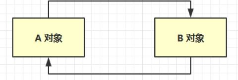

A 和 B 因为循环引用导致他们的引用计数都是 1，即使这两个对象都不会被使用，但由于引用计数不能归零导致他们不能被回收。

### 1.2 可达性分析算法
* Java 虚拟机中的垃圾回收器采用可达性分析来探索所有存活的对象
* 扫描堆中的对象，看是否能够沿着 GC Root对象 为起点的引用链找到该对象，找不到，表示可以回收
* 哪些对象可以作为 GC Root ?
    * System Class ：启动类加载器所加载的系统类
    * Native Stack ：调用的操作系统的方法引用的 java 对象
    * Thread ：活动线程中局部变量所引用的对象
    * Busy Monitor ：被加锁的对象

### 1.3 四种引用
1. 强引用
    * 只有**所有 GC Roots 对象都不通过【强引用】引用该对象，该对象才能被垃圾回收**
2. 软引用（SoftReference）
    * 仅有软引用引用该对象时，在垃圾回收后，**内存仍不足时会再次出发垃圾回收**，回收软引用对象
    * 可以配合引用队列来释放软引用自身
3. 弱引用（WeakReference）
    * 仅有弱引用引用该对象时，在垃圾回收时，**无论内存是否充足，都会回收弱引用对象**
    * 可以配合引用队列来释放弱引用自身
4. 虚引用（PhantomReference）
    * **必须配合引用队列使用**，主要配合 ByteBuffer 使用，被引用对象回收时，会将虚引用入队，
    * 由 Reference Handler 线程调用虚引用相关方法释放直接内存
5. 终结器引用（FinalReference）
    * 无需手动编码，但其**内部配合引用队列使用**，在垃圾回收时，终结器引用入队（被引用对象暂时没有被回收），再由 Finalizer 线程通过终结器引用找到被引用对象并调用它的 finalize方法，第二次 GC 时才能回收被引用对象

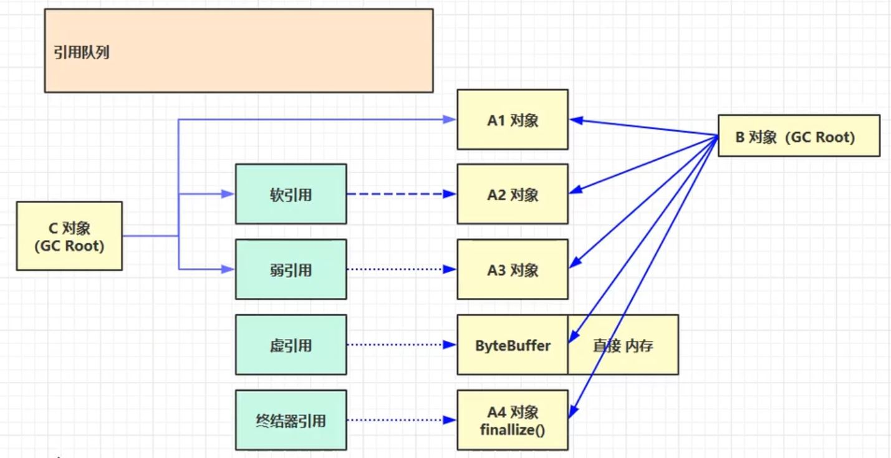

## 2. 垃圾回收算法
### 2.1 标记清除(Mark Sweep)
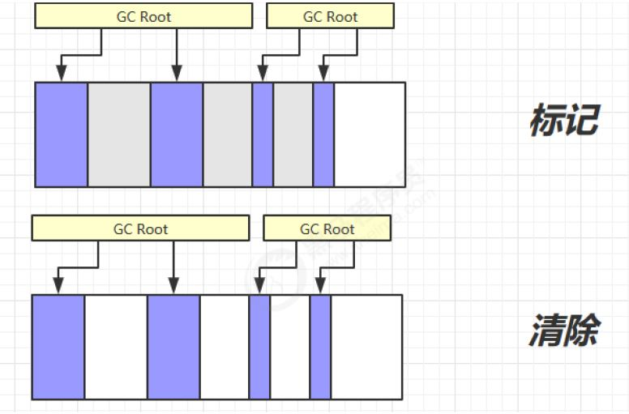

* 优点：速度快
* 缺点：容易产生内存碎片

### 2.2 标记整理(Mark Compact)
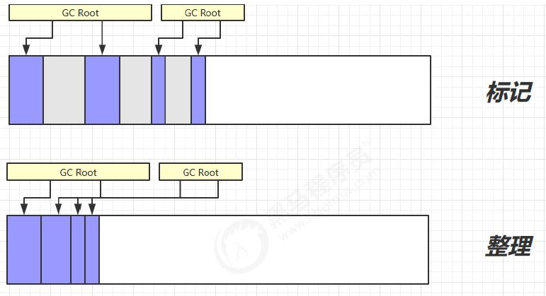

* 优点：使内存更加紧凑，有更多连续空间，减少内存碎片
* 缺点：速度较慢

### 2.3 复制(Copy)
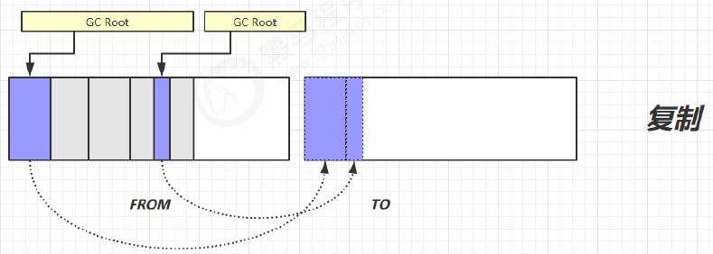

* 优点：不会有内存碎片
* 缺点：需要占用双倍内存空间

## 3. 分代垃圾回收
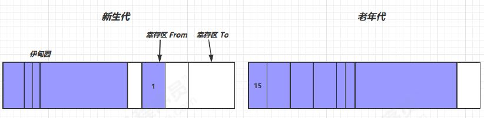

1. 对象首先分配在伊甸园区域
2. 新生代空间不足时，触发 minor gc，伊甸园和 from 存活的对象使用 copy 复制到 to 中，存活的对象年龄加 1 并且交换 from 、 to
3. minor gc 会引发 stop the world，暂停其它用户的线程，等垃圾回收结束，用户线程才恢复运行
4. 当对象寿命超过阈值时，会晋升至老年代，最大寿命是 15（4bit）
5. 当老年代空间不足，会先尝试触发 minor gc，如果之后空间仍不足，那么触发 full gc，STW的时间更长

### 3.1 相关 VM 参数
|含义|参数|
|:----|:----|
|堆初始大小|-Xms|
|堆最大大小|-Xmx 或 -XX:MaxHeapSize=size|
|新生代大小|-Xmn 或 (-XX:NewSize=size + -XX:MaxNewSize=size )|
|幸存区比例（动态）| -XX:InitialSurvivorRatio=ratio 和 -XX:+UseAdaptiveSizePolicy|
|幸存区比例|-XX:SurvivorRatio=ratio|
|晋升阈值|-XX:MaxTenuringThreshold=threshold|
|晋升详情|-XX:+PrintTenuringDistribution|
|GC详情|-XX:+PrintGCDetails -verbose:gc|
|FullGC 前 MinorGC| -XX:+ScavengeBeforeFullGC|

## 4. 垃圾回收器
1. 串行
    * 单线程
    * 堆内存较小，适合个人电脑
2. 吞吐量优先
    * 多线程
    * 堆内存较大，多核 cpu
    * **让单位时间内，STW 的时间最短** ，垃圾回收时间占比最低，这样就称吞吐量高
3. 响应时间优先
    * 多线程
    * 堆内存较大，多核 cpu
    * **尽可能让单次 STW 的时间最短**

### 4.1 串行
-XX:+UseSerialGC = Serial + SerialOld


### 4.2 吞吐量优先
-XX:+UseParallelGC ~ -XX:+UseParallelOldGC

-XX:+UseAdaptiveSizePolicy

-XX:GCTimeRatio=ratio

-XX:MaxGCPauseMillis=ms

-XX:ParallelGCThreads=n

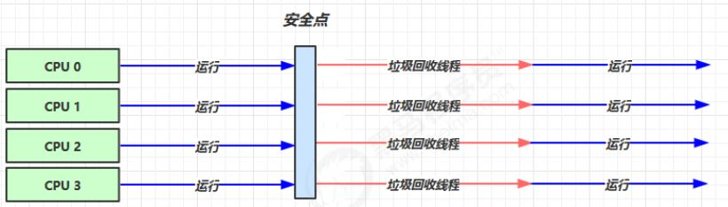

### 4.3 响应时间优先
-XX:+UseConcMarkSweepGC ~ -XX:+UseParNewGC ~ SerialOld

-XX:ParallelGCThreads=n ~ -XX:ConcGCThreads=threads

-XX:CMSInitiatingOccupancyFraction=percent

-XX:+CMSScavengeBeforeRemark

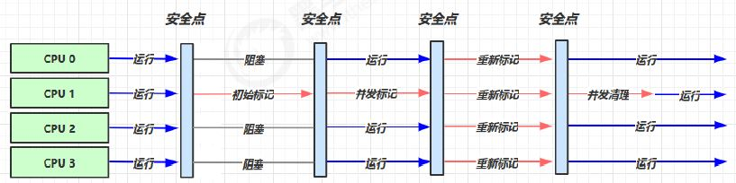

### 4.4 G1(Garbage First)
* 2004 论文发布
* 2009 JDK 6u14 体验
* 2012 JDK 7u4 官方支持
* 2017 JDK 9 默认

适用场景
* 同时注重吞吐量（Throughput）和低延迟（Low latency），默认的暂停目标是 200 ms
* 超大堆内存，会将堆划分为多个大小相等的 Region
* 整体上是标记 + 整理算法，两个区域之间是复制算法

相关 JVM 参数

-XX:+UseG1GC  
-XX:G1HeapRegionSize=size  
-XX:MaxGCPauseMillis=time

#### 1) G1 垃圾回收阶段
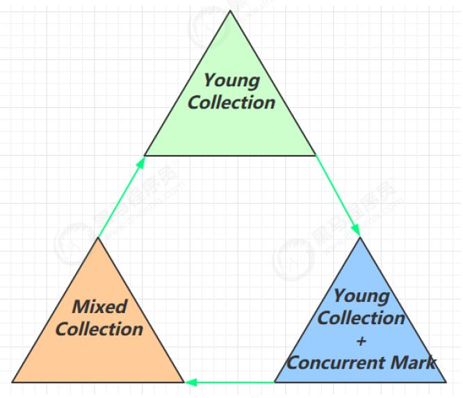

#### 2) Young Collection
* 会 STW

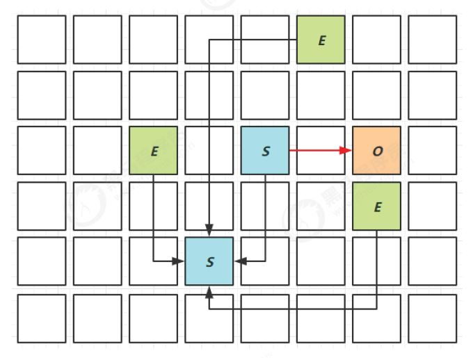

#### 3) Young Collection + CM
* 在 Young GC 时会进行 GC Root 的初始标记
* 老年代占用堆空间比例达到阈值时，进行并发标记（不会 STW），由下面的 JVM 参数决定
    * -XX:InitiatingHeapOccupancyPercent=percent （默认45%）

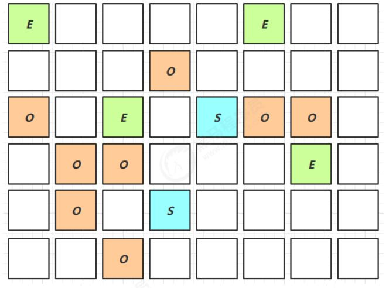

#### 4) Mixed Collection
会对 E、S、O 进行全面垃圾回收
* 最终标记（Remark）会 STW
* 拷贝存活（Evacuation）会 STW

-XX:MaxGCPauseMillis=ms

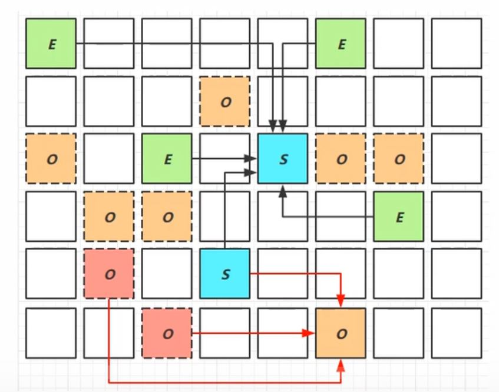

#### 5) Full GC
* SerialGC
    * 新生代内存不足发生的垃圾收集 - minor gc
    * 老年代内存不足发生的垃圾收集 - full gc
* ParallelGC
    * 新生代内存不足发生的垃圾收集 - minor gc
    * 老年代内存不足发生的垃圾收集 - full gc
* CMS
    * 新生代内存不足发生的垃圾收集 - minor gc
    * 老年代内存不足
* G1
    * 新生代内存不足发生的垃圾收集 - minor gc
    * 老年代内存不足

#### 6) Young Collection 跨代引用
* 新生代回收的跨代引用（老年代引用新生代）问题

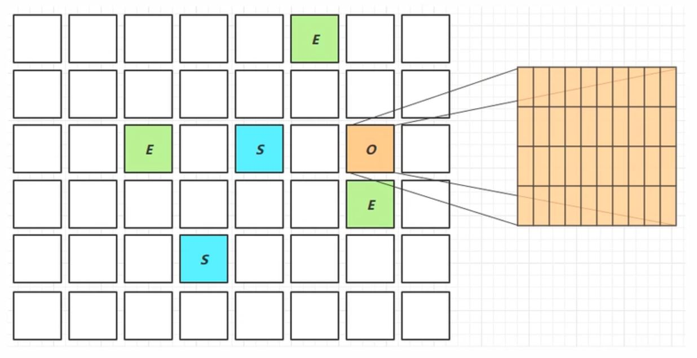

* 卡表与 Remembered Set
* 在引用变更时通过 post-write barrier + dirty card queue
* concurrent refinement threads 更新 Remembered Set

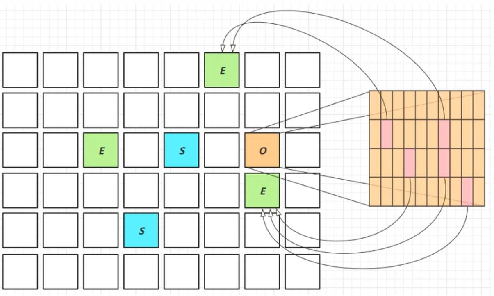

#### 7) Remark
* pre-write barrier + satb_mark_queue

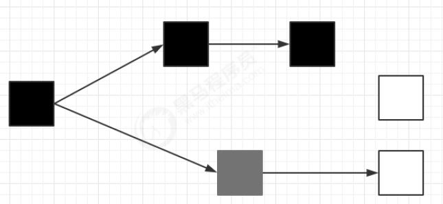

#### 8) JDK 8u20 字符串去重
* 优点：节省大量内存
* 缺点：略微多占用了 cpu 时间，新生代回收时间略微增加

-XX:+UseStringDeduplication

```java
String s1 = new String("hello"); // char[]{'h','e','l','l','o'}
String s2 = new String("hello"); // char[]{'h','e','l','l','o'}
```

* 将所有新分配的字符串放入一个队列
* 当新生代回收时，G1 并发检查是否有字符串重复
* 如果它们值一样，让它们引用同一个 char[]
* 注意，与 String.intern() 不一样
    * String.intern() 关注的是字符串对象
    * 而字符串去重关注的是 char[]
    * 在 JVM 内部，使用了不同的字符串表

#### 9) JDK 8u40 并发标记类卸载
所有对象都经过并发标记后，就能知道哪些类不再被使用，当一个类加载器的所有类都不再使用，则卸
载它所加载的所有类 -XX:+ClassUnloadingWithConcurrentMark 默认启用

#### 10) JDK 8u60 回收巨型对象
* 一个对象大于 region 的一半时，称之为巨型对象
* G1 不会对巨型对象进行拷贝
* 回收时被优先考虑
* G1 会跟踪老年代所有 incoming 引用，这样老年代 incoming 引用为 0 的巨型对象就可以在新生代垃圾回收时处理掉

#### 11) JDK 9 并发标记起始时间的调整
* 并发标记必须在堆空间占满前完成，否则退化为 FullGC
* JDK 9 之前需要使用 -XX:InitiatingHeapOccupancyPercent
* JDK 9 可以动态调整
    * -XX:InitiatingHeapOccupancyPercent 用来设置初始值
    * 进行数据采样并动态调整
    * 总会添加一个安全的空档空间

## 5. 垃圾回收调优
预备知识
* 掌握 GC 相关的 VM 参数，会基本的空间调整
* 掌握相关工具
* 明白一点：调优跟应用、环境有关，没有放之四海而皆准的法则

### 5.1 调优领域
* 内存
* 锁竞争
* cpu 占用
* io

### 5.2 确定目标
* 【低延迟】还是【高吞吐量】，选择合适的回收器
* CMS，G1，ZGC
* ParallelGC
* Zing

### 5.3 最快的 GC
**不发生 GC**

* 查看 FullGC 前后的内存占用，考虑下面几个问题
    * 数据是不是太多？
        * resultSet = statement.executeQuery("select * from 大表 limit n")
    * 数据表示是否太臃肿？
        * 对象图
        * 对象大小 16 Integer 24 int 4
    * 是否存在内存泄漏？
        * static Map map =
        * 软引用
        * 弱引用
        * 第三方缓存实现

### 5.4 新生代调优
* 新生代的特点
    * 所有的 new 操作的内存分配非常廉价
        * TLAB thread-local allocation buffer
    * 死亡对象的回收代价是零
    * 大部分对象用过即死
    * Minor GC 的时间远远低于 Full GC

* 越大越好吗？
    * 新生代空间过大，老年代的可用空间就少了。老年代空间紧张，触发的就是 Full GC 了，用时更长
    * 新生代的空间建议 > 堆大小的 25%，< 堆大小的 50%
* 新生代能容纳所有【并发量 * (请求 - 响应)】的数据
* 幸存区大到能保留【当前活跃对象+需要晋升对象】
    * 如果幸存区太小会让一些对象提前晋升，变相延长了他们的存活时间
* 晋升阈值配置得当，让长时间存活对象尽快晋升

    -XX:MaxTenuringThreshold=threshold  
    -XX:+PrintTenuringDistribution

### 5.5 老年代调优
以 CMS 为例
* CMS 的老年代内存越大越好
    * 避免浮动垃圾引起的并发失败
* 先尝试不做调优，如果没有 Full GC 那么无需调优，否则先尝试调优新生代
* 观察发生 Full GC 时老年代内存占用，将老年代内存预设调大 1/4 ~ 1/3
    * -XX:CMSInitiatingOccupancyFraction=percent

### 5.6 案例
* 案例1 Full GC 和 Minor GC频繁
    * 新生代空间紧张，幸存区晋升阈值降低。
* 案例2 请求高峰期发生 Full GC，单次暂停时间特别长 （CMS）
    * 重新标记会扫描整个内存，重新标记之前对新生代做一次 GC
    * (-XX:+CMSScavengeBeforeRemark)
* 案例3 老年代充裕情况下，发生 Full GC （CMS jdk1.7）
    * jdk1.8 用的是元空间作为方法区的实现，jdk1.7 用的是永久代作为方法区的实现
    * 永久代的空间不足也会导致 Full GC
