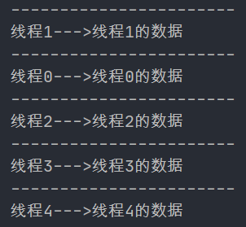
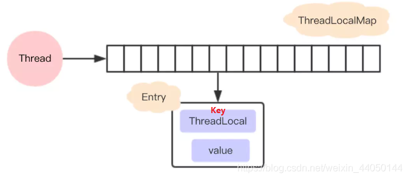

## ThreadLocal解析 

[参考教程](https://www.bilibili.com/video/BV1N741127FH?p=1)

###1 ThreadLocal介绍
####1.1 官方介绍
ThreadLocal 的作用：提供线程内的局部变量，不同线程之间不会相互干扰，这种变量在线程的生命周期内起作用，减少同一个线程内多个函数或组件之间一些公共变量传递的复杂度。  

>总结：  
>1. 线程并发：在多线程并发场景下使用
>2. 传递参数：可以通过ThreadLocal在同一线程的不同组件中传递公共变量
>3. 线程隔离：每个线程的变量都还是独立的，不会相互影响

####1.2 基本使用
#####1.2.1 常用方法
|方法声明|描述|
|:----|:----|
|ThreadLocal()|创建ThreadLocal对象|
|public void set( T value)|设置当前线程绑定的局部变量|
|public T get()|获取当前线程绑定的局部变量|
|public void remove()|移除当前线程绑定的局部变量|

#####1.2.2 使用案例
```java
public class MyDemo {
    private String content;

    private String getContent() {
        return content;
    }

    private void setContent(String content) {
        this.content = content;
    }

    public static void main(String[] args) {
        MyDemo demo = new MyDemo();
        for (int i = 0; i < 5; i++) {
            Thread thread = new Thread(new Runnable() {
                @Override
                public void run() {
                    demo.setContent(Thread.currentThread().getName() + "的数据");
                    System.out.println("-----------------------");
             		System.out.println(Thread.currentThread().getName() + "--->" + demo.getContent());
                }
            });
            thread.setName("线程" + i);
            thread.start();
        }
    }
}
```


使用 ThreadLocal 的 get 和 set 隔离后：
```java
public class MyDemo {

    private static ThreadLocal<String> tl = new ThreadLocal<>();

    private String content;

    private String getContent() {
        return tl.get();
    }

    private void setContent(String content) {
        tl.set(content);
    }

    public static void main(String[] args) {
        MyDemo demo = new MyDemo();
        for (int i = 0; i < 5; i++) {
            Thread thread = new Thread(new Runnable() {
                @Override
                public void run() {
                    demo.setContent(Thread.currentThread().getName() + "的数据");
                    System.out.println("-----------------------");
                    System.out.println(Thread.currentThread().getName() + "--->" + demo.getContent());
                }
            });
            thread.setName("线程" + i);
            thread.start();
        }
    }
}
```


####1.3 ThreadLocal类与synchronized关键字
#####1.3.1 synchronized同步方式
```java
public class MyDemo {

    private String content;

    public String getContent() {
        return content;
    }

    public void setContent(String content) {
        this.content = content;
    }

    public static void main(String[] args) {
        MyDemo demo = new MyDemo();

        for (int i = 0; i < 5; i++) {
            Thread t = new Thread(){
                @Override
                public void run() {
                    synchronized (MyDemo.class){
                        demo.setContent(Thread.currentThread().getName() + "的数据");
                        System.out.println("-------------------------------------");
                        String content = demo.getContent();
                        System.out.println(Thread.currentThread().getName() + "--->" + content);
                    }
                }
            };
            t.setName("线程" + i);
            t.start();
        }
    }
}
```

**加了锁程序的性能降低了！**

#####1.3.2 ThreadLocal与synchronized的区别
| |synchronized|ThreadLocal|
|:----:|:----:|:----:|
|原理|同步机制采用”以时间换空间“的方式, **只提供了一份变量**,让不同的线程排队访问|ThreadLocal采用’以空间换时间’的方式, **为每一个线程都提供了一份变量的副本**,从而实现同时访问而相不干扰|
|侧重|多个线程之间访问资源的同步|多线程中让每个线程之间的数据相互隔离|

###2 应用场景_事务案例
####2.1 转账场景
转账时转出和转入需要使用事务保证操作具备原子性，此处开启事务的注意点如下：
1. 为了保证所有的操作在一个事务中,使用的连接必须是同一个: service 层开启事务的 connection 需要跟 dao 层访问数据库的 connection 保持一致
2. 线程并发情况下, 每个线程只能操作各自的 connection

####2.2 常规解决方案
#####2.2.1 常规方案的实现
传参: 从 service 层将 connection 对象向 dao 层传递
加锁

弊端：
1. 提高代码耦合度（传参）
2. 降低程序性能（加锁后失去并发性）

####2.3 ThreadLocal解决方案
#####2.3.1 ThreadLocal方案的实现
原来：
*  直接从连接池中获取连接
 
现在：
* 直接获取当前线程绑定的连接对象  
* 如果连接对象是空的
    * 再去连接池中获取连接
    * 将此连接对象跟当前线程进行绑定

好处：
1. 传递数据 ： 保存每个线程绑定的数据，在需要的地方可以直接获取, 避免参数直接传递带来的代码耦合问题
2. 线程隔离 ： 各线程之间的数据相互隔离却又具备并发性，避免同步方式带来的性能损失

###3 ThreadLocal的内部结构
####3.1 常见的误解（过去的设计）
~~每个 ThreadLocal 都创建一个 Map，然后用线程作为 Map 的 key，要存储的局部变量作为 Map 的 value~~

####3.2 现在的设计
每个 Thread 维护一个 ThreadLocalMap，这个 Map 的 key 是 ThreadLocal 实例本身，value 才是真正要存储的值 Object。

具体的过程是这样的：

* 每个 Thread 线程内部都有一个 Map (ThreadLocalMap)
* Map 里面存储 ThreadLocal 对象（key）和线程的变量副本（value）
* Thread 内部的 Map 是由 ThreadLocal 维护的，由 ThreadLocal 负责向 map 获取和设置线程的变量值。
* 对于不同的线程，每次获取副本值时，别的线程并不能获取到当前线程的副本值，形成了副本的隔离，互不干扰。  



好处：
1. 每个 Map 存储的 Entry 数量变少
2. 当 Thread 销毁的时候，ThreadLocalMap 也会随之销毁，减少内存开销

###4 ThreadLocal的核心方法源码

|方法声明|描述|
|:----:|:----:|
|protected T initialValue()|返回当前线程局部变量的初始值|
|public void set(T value)|设置当前线程绑定的局部变量|
|public T get()|获取当前线程绑定的局部变量|
|public void remove()|移除当前线程绑定的局部变量|

####4.1 set方法
```java
public class ThreadLocal<T> {
  /**
     * 设置当前线程对应的 ThreadLocal 的值
     *
     * @param value 将要保存在当前线程对应的 ThreadLocal 的值
     */
    public void set(T value) {
        // 获取当前线程对象
        Thread t = Thread.currentThread();
        // 获取此线程对象中维护的 ThreadLocalMap 对象
        ThreadLocalMap map = getMap(t);
        // 判断 map 是否存在
        if (map != null)
            // 存在则调用 map.set 设置此实体 entry
            map.set(this, value);
        else
            // 1）当前线程 Thread 不存在 ThreadLocalMap 对象
            // 2）则调用 createMap 进行 ThreadLocalMap 对象的初始化
            // 3）并将 t (当前线程)和 value (t 对应的值)作为第一个 entry 存放至 ThreadLocalMap 中
            createMap(t, value);
    }

 /**
     * 获取当前线程 Thread 对应维护的 ThreadLocalMap 
     * 
     * @param  t the current thread 当前线程
     * @return the map 对应维护的ThreadLocalMap 
     */
    ThreadLocalMap getMap(Thread t) {
        return t.threadLocals;
    }
	/**
     *创建当前线程 Thread 对应维护的 ThreadLocalMap 
     *
     * @param t 当前线程
     * @param firstValue 存放到 map 中第一个entry的值
     */
	void createMap(Thread t, T firstValue) {
        //这里的 this 是调用此方法的 threadLocal
        t.threadLocals = new ThreadLocalMap(this, firstValue);
    }
}
```

set执行流程:
1. 首先获取当前线程，并根据当前线程获取一个 Map
2. 如果获取的 Map 不为空，则将参数设置到 Map 中（当前 ThreadLocal 的引用作为 key）
3. 如果 Map 为空，则给该线程创建 Map，并设置初始值

####4.2 get方法
```java
public class ThreadLocal<T> {
        /**
         * 返回当前线程中保存ThreadLocal的值
         * 如果当前线程没有此ThreadLocal变量，
         * 则它会通过调用{@link #initialValue} 方法进行初始化值
         *
         * @return 返回当前线程对应此ThreadLocal的值
         */
        public T get() {
            // 获取当前线程对象
            Thread t = Thread.currentThread();
            // 获取此线程对象中维护的ThreadLocalMap对象
            ThreadLocalMap map = getMap(t);
            // 如果此map存在
            if (map != null) {
                // 以当前的ThreadLocal 为 key，调用getEntry获取对应的存储实体e
                ThreadLocalMap.Entry e = map.getEntry(this);
                // 对e进行判空 
                if (e != null) {
                    @SuppressWarnings("unchecked")
                    // 获取存储实体 e 对应的 value值
                    // 即为我们想要的当前线程对应此ThreadLocal的值
                    T result = (T)e.value;
                    return result;
                }
            }
            /*
            	初始化 : 有两种情况有执行当前代码
            	第一种情况: map不存在，表示此线程没有维护的ThreadLocalMap对象
            	第二种情况: map存在, 但是没有与当前ThreadLocal关联的entry
             */
            return setInitialValue();
        }
    
        /**
         * 初始化
         *
         * @return the initial value 初始化后的值
         */
        private T setInitialValue() {
            // 调用initialValue获取初始化的值
            // 此方法可以被子类重写, 如果不重写默认返回null
            T value = initialValue();
            // 获取当前线程对象
            Thread t = Thread.currentThread();
            // 获取此线程对象中维护的ThreadLocalMap对象
            ThreadLocalMap map = getMap(t);
            // 判断map是否存在
            if (map != null)
                // 存在则调用map.set设置此实体entry
                map.set(this, value);
            else
                // 1）当前线程Thread 不存在ThreadLocalMap对象
                // 2）则调用createMap进行ThreadLocalMap对象的初始化
                // 3）并将 t(当前线程)和value(t对应的值)作为第一个entry存放至ThreadLocalMap中
                createMap(t, value);
            // 返回设置的值value
            return value;
        }
}
```

get执行流程：
1. 首先获取当前线程, 根据当前线程获取一个 Map
2. 如果获取的 Map 不为空，则在 Map 中以 ThreadLocal 的引用作为 key 来在 Map 中获取对应的 Entry e，否则转到 4
3. 如果 e 不为 null，则返回 e.value，否则转到 4
4. Map 为空或者 e 为空，则通过 initialValue 函数获取初始值 value，然后用 ThreadLocal 的引用和 value 作为 firstKey 和 firstValue 创建一个新的 Map

**先获取当前线程的 ThreadLocalMap 变量，如果存在则返回值，不存在则创建并返回初始值。**

####4.3 remove方法
```java
public class ThreadLocal<T> {
     /**
         * 删除当前线程中保存的ThreadLocal对应的实体entry
         */
         public void remove() {
            // 获取当前线程对象中维护的ThreadLocalMap对象
             ThreadLocalMap m = getMap(Thread.currentThread());
            // 如果此map存在
             if (m != null)
                // 存在则调用map.remove
                // 以当前ThreadLocal为key删除对应的实体entry
                 m.remove(this);
         }

}
```
remove执行流程：
1. 首先获取当前线程，并根据当前线程获取一个 Map
2. 如果获取的 Map 不为空，则移除当前 ThreadLocal 对象对应的 entry

####4.4 initialValue方法
```java
public class ThreadLocal<T> {
    /**
      * 返回当前线程对应的ThreadLocal的初始值
      
      * 此方法的第一次调用发生在，当线程通过get方法访问此线程的ThreadLocal值时
      * 除非线程先调用了set方法，在这种情况下，initialValue 才不会被这个线程调用。
      * 通常情况下，每个线程最多调用一次这个方法。
      *
      * <p>这个方法仅仅简单的返回null {@code null};
      * 如果程序员想ThreadLocal线程局部变量有一个除null以外的初始值，
      * 必须通过子类继承{@code ThreadLocal} 的方式去重写此方法
      * 通常, 可以通过匿名内部类的方式实现
      *
      * @return 当前ThreadLocal的初始值
      */
    protected T initialValue() {
        return null;
    }
    

}
```
作用：返回该线程局部变量的初始值。
1. 这个方法是一个延迟调用方法，从上面的代码我们得知，在 set 方法还未调用而先调用了 get 方法时才执行，并且仅执行1次。
2. 这个方法缺省实现直接返回一个 null。
3. 如果想要一个除 null 之外的初始值，可以重写此方法。（备注： 该方法是一个 protected 的方法，显然是为了让子类覆盖而设计的）


###5 ThreadLocalMap源码分析
####5.1 基本结构
ThreadLocalMap 是 ThreadLocal 的内部类，没有实现 Map 接口，用独立的方式实现了 Map 的功能，其内部的 Entry 也是独立实现。

>跟 HashMap 类似，INITIAL_CAPACITY 代表这个 Map 的初始容量；table 是一个 Entry 类型的数组，用于存储数据；size 代表表中的存储数目；threshold 代表需要扩容时对应 size 的阈值。

>在 ThreadLocalMap 中，也是用 Entry 来保存 K-V 结构数据的。不过 Entry 中的 key 只能是 ThreadLocal 对象，这点在构造方法中已经限定死了。
>
>另外，Entry 继承 WeakReference，也就是 key（ThreadLocal）是弱引用，其目的是将 ThreadLocal 对象的生命周期和线程生命周期解绑。

####5.2 弱引用和内存泄漏
#####（1） 内存泄漏相关概念
*   Memory overflow:内存溢出，没有足够的内存提供申请者使用。
*   Memory leak: 内存泄漏是指程序中已动态分配的堆内存由于某种原因程序未释放或无法释放，造成系统内存的浪费，导致程序运行速度减慢甚至系统崩溃等严重后果。内存泄漏的堆积终将导致内存溢出。

#####（2） 弱引用相关概念

Java中的引用有4种类型： 强、软、弱、虚。当前这个问题主要涉及到强引用和弱引用：

**强引用（“Strong” Reference）**，就是我们最常见的普通对象引用，只要还有强引用指向一个对象，就能表明对象还“活着”，垃圾回收器就不会回收这种对象。

**弱引用（WeakReference）**，垃圾回收器一旦发现了只具有弱引用的对象，不管当前内存空间足够与否，都会回收它的内存。

#####（3） 如果key使用强引用

假设 ThreadLocalMap 中的 key 使用了强引用，那么会出现内存泄漏吗？

此时 ThreadLocal 的内存图（实线表示强引用）如下：
  


假设在业务代码中使用完 ThreadLocal，threadLocal Ref 被回收了。

但是因为 threadLocalMap 的 Entry 强引用了 threadLocal，造成 threadLocal 无法被回收。

在没有手动删除这个 Entry 以及 CurrentThread 依然运行的前提下，始终有强引用链 threadRef -> currentThread -> threadLocalMap -> entry，Entry 就不会被回收（Entry 中包括了 ThreadLocal 实例和 value），导致 Entry 内存泄漏。

也就是说，ThreadLocalMap 中的 key 使用了强引用，是无法完全避免内存泄漏的。

#####（4）如果key使用弱引用

那么 ThreadLocalMap 中的 key 使用了弱引用，会出现内存泄漏吗？

此时 ThreadLocal 的内存图（实线表示强引用，虚线表示弱引用）如下：
  

​ 
同样假设在业务代码中使用完 ThreadLocal ，threadLocal Ref 被回收了。

由于 ThreadLocalMap 只持有 ThreadLocal 的弱引用，没有任何强引用指向 threadLocal 实例, 所以 threadLocal 就可以顺利被 gc 回收，此时 Entry 中的 key=null。

但是在没有手动删除这个 Entry 以及 CurrentThread 依然运行的前提下，也存在有强引用链 threadRef -> currentThread -> threadLocalMap -> entry -> value ，value 不会被回收， 而这块 value 永远不会被访问到了，导致 value 内存泄漏。

也就是说，ThreadLocalMap 中的 key 使用了弱引用，也有可能内存泄漏。

#####（5）出现内存泄漏的真实原因

比较以上两种情况，我们就会发现，内存泄漏的发生跟 ThreadLocalMap中的key 是否使用弱引用是没有关系的。那么内存泄漏的的真正原因是什么呢？

在以上两种内存泄漏的情况中，都有两个前提：

    没有手动删除这个 Entry
    CurrentThread 依然运行

第一点很好理解，只要在使用完 ThreadLocal，调用其 remove 方法删除对应的 Entry，就能避免内存泄漏。

第二点稍微复杂一点， 由于 ThreadLocalMap 是 Thread 的一个属性，被当前线程所引用，所以它的生命周期跟 Thread 一样长。那么在使用完 ThreadLocal 之后，如果当前 Thread 也随之执行结束，ThreadLocalMap 自然也会被 gc 回收，从根源上避免了内存泄漏。

**综上，ThreadLocal 内存泄漏的根源是：由于 ThreadLocalMap 的生命周期跟 Thread 一样长，如果没有手动删除对应 key 就会导致内存泄漏。**

#####（6） 为什么使用弱引用

根据刚才的分析, 我们知道了： 无论 ThreadLocalMap 中的 key 使用哪种类型引用都无法完全避免内存泄漏，跟使用弱引用没有关系。

要避免内存泄漏有两种方式：

1. 使用完 ThreadLocal，调用其 remove 方法删除对应的 Entry

2. 使用完 ThreadLocal，当前 Thread 也随之运行结束

相对第一种方式，第二种方式显然更不好控制，特别是使用线程池的时候，线程结束是不会销毁的。

也就是说，只要记得在使用完 ThreadLocal 及时的调用 remove，无论 key 是强引用还是弱引用都不会有问题。那么为什么 key 要用弱引用呢？

事实上，在 ThreadLocalMap 中的 set/getEntry 方法中，会对 key 为 null（也即是 ThreadLocal 为 null）进行判断，如果为 null 的话，那么是会对 value 置为 null 的。

​ 这就意味着使用完 ThreadLocal，CurrentThread 依然运行的前提下，就算忘记调用 remove 方法，弱引用比强引用可以多一层保障：弱引用的 ThreadLocal 会被回收，对应的 value 在下一次 ThreadLocalMap 调用 set , get , remove 中的任一方法的时候会被清除，从而避免内存泄漏。

####5.3 hash冲突的解决
#####（1） 首先从ThreadLocal的set() 方法入手
```java
public void set(T value) {
        Thread t = Thread.currentThread();
        ThreadLocal.ThreadLocalMap map = getMap(t);
        if (map != null)
            //调用了ThreadLocalMap的set方法
            map.set(this, value);
        else
            createMap(t, value);
    }
    
    ThreadLocal.ThreadLocalMap getMap(Thread t) {
        return t.threadLocals;
    }

    void createMap(Thread t, T firstValue) {
        	//调用了ThreadLocalMap的构造方法
        t.threadLocals = new ThreadLocal.ThreadLocalMap(this, firstValue);
    }
```
这段代码有两个地方分别涉及到 ThreadLocalMap 的两个方法。

#####（2）构造方法```ThreadLocalMap(ThreadLocal<?> firstKey, Object firstValue)```
```java
 /*
  * firstKey : 本ThreadLocal实例(this)
  * firstValue ： 要保存的线程本地变量
  */
ThreadLocalMap(ThreadLocal<?> firstKey, Object firstValue) {
        //初始化table
        table = new ThreadLocal.ThreadLocalMap.Entry[INITIAL_CAPACITY];
        //计算索引(重点代码）
        int i = firstKey.threadLocalHashCode & (INITIAL_CAPACITY - 1);
        //设置值
        table[i] = new ThreadLocal.ThreadLocalMap.Entry(firstKey, firstValue);
        size = 1;
        //设置阈值
        setThreshold(INITIAL_CAPACITY);
    }

```

构造函数首先创建一个长度为16的 Entry 数组，然后计算出 firstKey 对应的索引，然后存储到 table 中，并设置 size 和 threshold。

**重点分析：** ```int i = firstKey.threadLocalHashCode & (INITIAL_CAPACITY - 1)```

######a. 关于```firstKey.threadLocalHashCode```：
```java
 	private final int threadLocalHashCode = nextHashCode();
    
    private static int nextHashCode() {
        return nextHashCode.getAndAdd(HASH_INCREMENT);
    }
//AtomicInteger是一个提供原子操作的Integer类，通过线程安全的方式操作加减,适合高并发情况下的使用
    private static AtomicInteger nextHashCode =  new AtomicInteger();
     //特殊的hash值
    private static final int HASH_INCREMENT = 0x61c88647;

```

这里定义了一个 AtomicInteger 类型，每次获取当前值并加上 HASH_INCREMENT，HASH_INCREMENT = 0x61c88647,这个值跟斐波那契数列（黄金分割数）有关，其主要目的就是为了让哈希码能均匀的分布在2的 n 次方的数组里, 也就是 Entry[] table中，这样做可以尽量避免 hash 冲突。

######b. 关于```& (INITIAL_CAPACITY - 1)```

计算 hash 的时候里面采用了hashCode & (size - 1)的算法，这相当于取模运算 hashCode % size 的一个更高效的实现。正是因为这种算法，我们要求 size 必须是2的整次幂，这也能保证在索引不越界的前提下，使得 hash 发生冲突的次数减小。

#####（3） ThreadLocalMap中的set方法
```java
private void set(ThreadLocal<?> key, Object value) {
        ThreadLocal.ThreadLocalMap.Entry[] tab = table;
        int len = tab.length;
        //计算索引(重点代码，刚才分析过了）
        int i = key.threadLocalHashCode & (len-1);
        /**
         * 使用线性探测法查找元素（重点代码）
         */
        for (ThreadLocal.ThreadLocalMap.Entry e = tab[i];
             e != null;
             e = tab[i = nextIndex(i, len)]) {
            ThreadLocal<?> k = e.get();
            //ThreadLocal 对应的 key 存在，直接覆盖之前的值
            if (k == key) {
                e.value = value;
                return;
            }
            // key为 null，但是值不为 null，说明之前的 ThreadLocal 对象已经被回收了，
           // 当前数组中的 Entry 是一个陈旧（stale）的元素
            if (k == null) {
                //用新元素替换陈旧的元素，这个方法进行了不少的垃圾清理动作，防止内存泄漏
                replaceStaleEntry(key, value, i);
                return;
            }
        }
    
    	//ThreadLocal对应的key不存在并且没有找到陈旧的元素，则在空元素的位置创建一个新的Entry。
            tab[i] = new Entry(key, value);
            int sz = ++size;
            /**
             * cleanSomeSlots用于清除那些e.get()==null的元素，
             * 这种数据key关联的对象已经被回收，所以这个Entry(table[index])可以被置null。
             * 如果没有清除任何entry,并且当前使用量达到了负载因子所定义(长度的2/3)，那么进行			
        	 * rehash（执行一次全表的扫描清理工作）
             */
            if (!cleanSomeSlots(i, sz) && sz >= threshold)
                rehash();
}

 /**
     * 获取环形数组的下一个索引
     */
    private static int nextIndex(int i, int len) {
        return ((i + 1 < len) ? i + 1 : 0);
    }


```
​ 
代码执行流程：
A. 首先还是根据 key 计算出索引 i，然后查找 i 位置上的 Entry，
B. 若是 Entry 已经存在并且 key 等于传入的 key，那么这时候直接给这个 Entry 赋新的 value 值,
C. 若是 Entry 存在，但是 key 为 null，则调用 replaceStaleEntry 来更换这个 key 为空的 Entry,
D. 不断循环检测，直到遇到为 null 的地方，这时候要是还没在循环过程中 return，那么就在这个 null 的位置新建一个 Entry，并且插入，同时 size 增加1。

最后调用 cleanSomeSlots，清理 key 为 null 的 Entry，最后返回是否清理了 Entry，接下来再判断 sz 是否>= thresgold 达到了 rehash 的条件，达到的话就会调用 rehash 函数执行一次全表的扫描清理。

**重点分析**： ThreadLocalMap 使用线性探测法来解决哈希冲突的。

该方法一次探测下一个地址，直到有空的地址后插入，若整个空间都找不到空余的地址，则产生溢出。

举个例子，假设当前 table 长度为16，也就是说如果计算出来 key 的 hash 值为14，如果 table[14] 上已经有值，并且其 key 与当前 key 不一致，那么就发生了 hash 冲突，这个时候将14加1得到15，取 table[15] 进行判断，这个时候如果还是冲突会回到0，取 table[0],以此类推，直到可以插入。

按照上面的描述，可以把 Entry[] table 看成一个环形数组。

