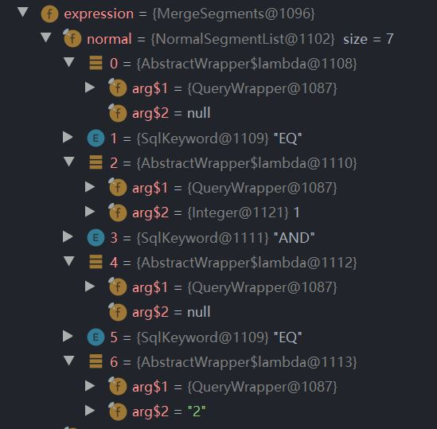
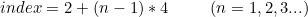
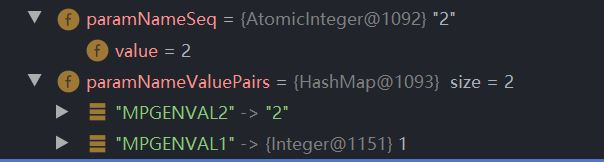

# 探究 MP 中的 QueryMapper
## 1 留档原因
在对 MP 中填入各种 EQ、OEDERBY 等查询条件时，QueryMapper 中会存储这些关键字信息。在一次编写单元测试想对其进行校验时，我花费一番功夫阅读了 MP 中相关源码，自行编写了一个简单的工具类。其功能是取出 QueryMapper 中的真实关键字进行判断、对比，而非带有形如 "MPGENVAL" 关键字的 MP 自动拼接的 sql 语句。

这是我第一次阅读开源框架源码，有不小的收获，故留档。

## 2 心路历程
工具类中将查询条件分为 3 大类：normal、having、orderBy。

### 2.1 normal
#### 2.1.1 normal 中是怎么存储关键字的？
大部分输入的参数都在这里进行拼接，如：EQ、LT、GT、LIKE、BETWEEN 等。这些参数存储在 wrapper 的 expression 下的 normal 域里。



如上图所示，在 wrapper 中我加入了两个 EQ 参数，分别是 1 和 “2”，而 normal 这个 list 中存储参数的方式并非连续存储，而是已经为我们进行拼接：索引 0 的位置是字段信息，索引 1 存储关键字 EQ ，索引 2 存储填入的查询条件关键字，以此类推。

当有多个条件时，会自动为我们拼接上 AND 关键字，他也占 list 的一席之地。通俗地说，我们输入的查询关键字所在的索引即为：



#### 2.1.2 normal param check 例程
下面展示获取 normal list 中参数的例程：

```java
private static void getNormalParams(Map<Object, Integer> paramMap, AbstractWrapper wrapper) {
    // 获取 wrapper 中 expression 下 normal 中的关键字列表
    NormalSegmentList normalList = wrapper.getExpression().getNormal();

    for (ISqlSegment iSqlSegment : normalList) {
        /*
         * 形如 EQ、IN 等 sql 关键字无法通过 getSqlSegment 转换，需要抓住异常
         * 最终 ParamNameValuePairs 中只有输入的查询条件参数
         */
        try {
            // 将 normal list 中的查询条件存入 wrapper 的 ParamNameValuePairs 中
            iSqlSegment.getSqlSegment();
        } catch (MybatisPlusException mybatisPlusException) {
            continue;
        }

    }

    for (Object key : wrapper.getParamNameValuePairs().keySet()) {
        // 获取 ParamNameValuePairs 中的 value
        Object curValue = wrapper.getParamNameValuePairs().get(key);
        paramMap.put(curValue, paramMap.getOrDefault(curValue, 0) + 1);
    }
    // 重置 map，避免重复调用重复获取
    wrapper.getParamNameValuePairs().clear();
}
```

上述例程大体上分为 3 步：
1. 遍历 normalList ，将需要验证的查询条件导入到 ParamNameValuePairs 中
2. 遍历 ParamNameValuePairs ，获取键值对的值，存入一个 map 中用于后续比较
    * 该 map 的 key 是查询条件关键字，value 是关键字出现的次数，防止关键字重复无法正确判别的情况
3. 重置、清空 ParamNameValuePairs

##### 2.1.2.1 step 1
第一步很好理解，通过先前对 normalList 的分析我们知道，要获取其中的查询关键字只要按推导出的下标公式顺序获取即可。这里用了另一种方法，即使用一个 try - catch 将 normalList 中所有内容都导入 ParamNameValuePairs 里去。

完成此步骤后，此时 ParamNameValuePairs 中的内容如下图所示：



可以看到键值对的 key 是 MP 拼接 “MPGENVAL” 和一个 AtomicInteger 而成的，而 value 则是我们需要的查询关键字。

##### 2.1.2.2 step 2
第二步其实就是记录下这些键值对的值用于后续比较，存储的 map 即是我们得到的实际结果。

##### 2.1.2.3 step 3
第三步需要注意的是，尽管我们清空了 paramNameValuePairs ，但是 AtomicInteger 还是保持原有的计数。也就是说下一次为 wrapper 填入查询关键字且导入 paramNameValuePairs 中时，拼接的 key 是接着计数的，而非归 ”1“ 。本例中会从 3 开始继续计数。

#### 2.2.3 探究 MP 中添加查询关键字的源码
以 EQ 为例：

首先 AbstractWrapper 中实现了 Compare 接口，其中的 EQ 方法如下：

```java
public interface Compare<Children, R> extends Serializable {
    default Children eq(R column, Object val) {
        return eq(true, column, val);
    }

    /**
     * 等于 =
     *
     * @param condition 执行条件
     * @param column    字段
     * @param val       值
     * @return children
     */
    Children eq(boolean condition, R column, Object val);

}
```

我们在实际业务中其实也会遇到相关的情况，比如：查询关键字是空。这时候可以省去 ifelse 写法而是用带有 condition 的 eq 进行参数添加，使代码更简洁。

```java
// 1、if 写法
if(keyword != null){
    queryWrapper.eq(column, keyword);
}

// 2、带 condition 的 eq 方法
queryWrapper.eq(keyword != null,column, keyword);
```

### 2.2 having


## total
***
```java
public class QueryWrapperParamCheckUtil {
    /**
     * 判断所有参数均相等
     *
     * @param normalWanted normal 条件数组
     */
    public static boolean normalCheck(Object[] normalWanted, Wrapper<?> wrapper) {
        AbstractWrapper wp = (AbstractWrapper) wrapper;

        // Map 的 key 记录参数、关键字等；value 记录参数出现的次数（用于比较相同参数多次出现，需要判断其出现次数的情况）
        Map<Object, Integer> normalMap = new HashMap<>();

        if (!isEmptyNormalParams(wp))
            getNormalParams(normalMap, wp);

        // 处理输入参数中的集合并进行拆分
        if (normalWanted != null)
            normalWanted = splitArray(normalWanted);

        return isEquals(normalWanted, normalMap);

    }

    /**
     * 判断所有参数均相等
     *
     * @param havingWanted having 条件数组
     */
    public static boolean havingCheck(Object[] havingWanted, Wrapper<?> wrapper) {
        AbstractWrapper wp = (AbstractWrapper) wrapper;

        // Map 的 key 记录参数、关键字等；value 记录参数出现的次数（用于比较相同参数多次出现，需要判断其出现次数的情况）
        Map<Object, Integer> havingMap = new HashMap<>();

        if (!isEmptyHaving(wp))
            getHavingParams(havingMap, wp);

        // 处理输入参数中的集合并进行拆分
        if (havingWanted != null)
            havingWanted = splitArray(havingWanted);

        return isEquals(havingWanted, havingMap);

    }

    /**
     * 判断所有参数均相等
     *
     * @param orderByWanted orderBy 排序需求
     */
    public static boolean orderByCheck(Object[] orderByWanted, Wrapper<?> wrapper) {
        AbstractWrapper wp = (AbstractWrapper) wrapper;

        // Map 的 key 记录参数、关键字等；value 记录参数出现的次数（用于比较相同参数多次出现，需要判断其出现次数的情况）
        Map<Object, Integer> orderByMap = new HashMap<>();

        if (!isEmptyOrderBy(wp))
            getOrderByParams(orderByMap, wp);

        // 处理输入参数中的集合并进行拆分
        if (orderByWanted != null)
            orderByWanted = splitArray(orderByWanted);

        return isEquals(orderByWanted, orderByMap);

    }

    /**
     * 校验 LastSQL
     *
     * @param lastSQL LastSQL
     * @return 若包含 LastSQL 返回 true，否则返回 false
     */
    public static boolean lastSQLCheck(String lastSQL, Wrapper<?> wrapper) {
        AbstractWrapper wp = (AbstractWrapper) wrapper;
        String sqlSegment = wp.getSqlSegment();
        // 重置 map，避免重复调用重复获取
        wp.getParamNameValuePairs().clear();
        return sqlSegment.indexOf(lastSQL) == sqlSegment.length() - lastSQL.length();
    }

    /**
     * 判断所有参数均相等
     *
     * @param normalWanted  normal 条件数组
     * @param havingWanted  having 条件数组
     * @param orderByWanted orderBy 排序需求
     */
    @Deprecated
    public static boolean paramCheck(Object[] normalWanted, Object[] havingWanted, Object[] orderByWanted, Wrapper<?> wrapper) {
        AbstractWrapper wp = (AbstractWrapper) wrapper;

        // Map 的 key 记录参数、关键字等；value 记录参数出现的次数（用于比较相同参数多次出现，需要判断其出现次数的情况）
        Map<Object, Integer> normalMap = new HashMap<>();
        Map<Object, Integer> havingMap = new HashMap<>();
        Map<Object, Integer> orderByMap = new HashMap<>();

        if (!isEmptyNormalParams(wp))
            getNormalParams(normalMap, wp);
        if (!isEmptyHaving(wp))
            getHavingParams(havingMap, wp);
        if (!isEmptyOrderBy(wp))
            getOrderByParams(orderByMap, wp);

        if (normalWanted != null)
            normalWanted = splitArray(normalWanted);
        if (havingWanted != null)
            havingWanted = splitArray(havingWanted);
        if (orderByWanted != null)
            orderByWanted = splitArray(orderByWanted);

        return isEquals(normalWanted, normalMap)
                && isEquals(havingWanted, havingMap)
                && isEquals(orderByWanted, orderByMap);

    }

    /**
     * 判断预期结果和实际结果是否完全相等（大小相等，内容一致）
     *
     * @param wanted 预期结果
     * @param res    实际结果
     * @return 相等返回 true ，不相等返回 false
     */
    private static boolean isEquals(Object[] wanted, Map<Object, Integer> res) {
        return sameSize(wanted, res) && sameParam(wanted, res);
    }

    /**
     * 判断预期结果和实际结果大小是否相等
     *
     * @param wanted 预期结果
     * @param res    实际结果
     * @return 大小相等或输入预期为空时返回 true，不相等返回 false
     */
    private static boolean sameSize(Object[] wanted, Map<Object, Integer> res) {
        if (null == wanted) {
            return true;
        }
        int size = 0;
        for (Integer value : res.values()) {
            size += value;
        }
        return wanted.length == size;
    }

    /**
     * 判断预期结果和实际结果内容是否一致
     *
     * @param wanted 预期结果
     * @param res    实际结果
     * @return 内容一致或输入预期为空时返回 true，任一不等返回 false
     */
    private static boolean sameParam(Object[] wanted, Map<Object, Integer> res) {
        if (null == wanted) {
            return true;
        }
        /*
          遍历预期结果，在 Map 中减少计数
         */
        for (Object param : wanted) {
            if (res.containsKey(param)) {
                res.put(param, res.get(param) - 1);
            }
        }
        /*
          若存在 key 的计数没有减到 0 则返回 false
         */
        for (Integer counts : res.values()) {
            if (counts != 0)
                return false;
        }
        return true;
    }

    /**
     * 获取 normal 参数
     *
     * @param paramMap 实际结果
     */
    private static void getNormalParams(Map<Object, Integer> paramMap, AbstractWrapper wrapper) {
        // 获取 wrapper 中 expression 下 normal 中的关键字列表
        NormalSegmentList normalList = wrapper.getExpression().getNormal();

        for (ISqlSegment iSqlSegment : normalList) {
            /*
             * sql 关键字无法通过 getSqlSegment 转换，需要抓住异常
             * 最终 ParamNameValuePairs 中只有输入的查询条件参数
             */
            try {
                iSqlSegment.getSqlSegment();
            } catch (MybatisPlusException mybatisPlusException) {
                continue;
            }

        }

        for (Object key : wrapper.getParamNameValuePairs().keySet()) {
            // 获取 ParamNameValuePairs 中的value，将 DateTime 类型转换为 String
            Object curValue = wrapper.getParamNameValuePairs().get(key);
            paramMap.put(curValue, paramMap.getOrDefault(curValue, 0) + 1);
        }
        // 重置 map，避免重复调用重复获取
        wrapper.getParamNameValuePairs().clear();
    }

    /**
     * 获取 having 参数
     *
     * @param paramMap 实际结果
     */
    private static void getHavingParams(Map<Object, Integer> paramMap, AbstractWrapper wrapper) {
        // 获取 wrapper 中 expression 下 having 中的关键字列表
        HavingSegmentList havingList = wrapper.getExpression().getHaving();
        for (ISqlSegment curSqlSegment : havingList) {
            if (!curSqlSegment.getClass().equals(SqlKeyword.class)) {
                // 获取待拼接的 sql
                String value = curSqlSegment.getSqlSegment();
                String sqlAfterReplace = replacehavingSQLWithRealParams(value, wrapper);
                paramMap.put(sqlAfterReplace, paramMap.getOrDefault(sqlAfterReplace, 0) + 1);
            }
        }
        // 重置 map，避免重复调用重复获取
        wrapper.getParamNameValuePairs().clear();
    }

    /**
     * 获取 orderBy 参数
     *
     * @param paramMap 实际结果
     */
    private static void getOrderByParams(Map<Object, Integer> paramMap, AbstractWrapper wrapper) {
        // 获取 wrapper 中 expression 下 oederBy 中的关键字列表
        OrderBySegmentList orderByList = wrapper.getExpression().getOrderBy();
        for (ISqlSegment curSqlSegment : orderByList) {
            if (curSqlSegment.getClass().equals(SqlKeyword.class)) {
                String order = curSqlSegment.toString();
                paramMap.put(order, paramMap.getOrDefault(order, 0) + 1);
            }
        }
    }

    /**
     * 判断 normal 中是否有参数
     */
    public static boolean isEmptyNormalParams(Wrapper<?> wrapper) {
        return wrapper.getExpression().getNormal().size() == 0;
    }

    /**
     * 判断 having 中是否有参数
     */
    public static boolean isEmptyHaving(Wrapper<?> wrapper) {
        return wrapper.getExpression().getHaving().size() == 0;
    }

    /**
     * 判断 orderBy 中是否有参数
     */
    public static boolean isEmptyOrderBy(Wrapper<?> wrapper) {
        return wrapper.getExpression().getOrderBy().size() == 0;
    }

    /**
     * 将 having 子句中形如 {0} 的部分替换为真实参数
     *
     * @param sql 需要替换参数的 SQL 语句
     */
    private static String replacehavingSQLWithRealParams(String sql, AbstractWrapper wrapper) {
        // Mybatis Plus 自动替换的样式
        String autoReplace = "\\#\\{ew.paramNameValuePairs.MPGENVAL\\d\\}";
        // 正则表达式匹配
        Pattern pattern = Pattern.compile(autoReplace);
        Matcher matcher = pattern.matcher(sql);
        // 用于接收真实参数
        Object real;
        while (matcher.find()) {
            String needReplace = matcher.group(0);
            // 截取真实参数在 paramNameValuePairs 中的 key
            String paramNameValuePairsKey = needReplace.replace("#{ew.paramNameValuePairs.", "").replace("}", "");
            // 获取真实参数
            real = wrapper.getParamNameValuePairs().get(paramNameValuePairsKey);
            sql = sql.replace(needReplace, real.toString());
        }

        return sql;
    }

    /**
     * 处理输入数组中可能存在的集合类型并将其拆分
     *
     * @param original 输入数组
     * @return 拆分集合后的原数组
     */
    private static Object[] splitArray(Object[] original) {
        ArrayList<Object> tmpArray = new ArrayList<>();
        for (Object o : original) {
            if (o.getClass().isArray()) {
                tmpArray.addAll(Arrays.asList((Object[]) o));
                continue;
            }
            if (o instanceof List<?>) {
                tmpArray.addAll((List<?>) o);
                continue;
            }
            tmpArray.add(o);
        }
        return tmpArray.toArray();
    }

}

```