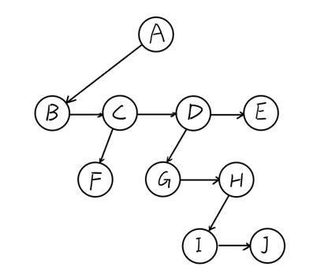
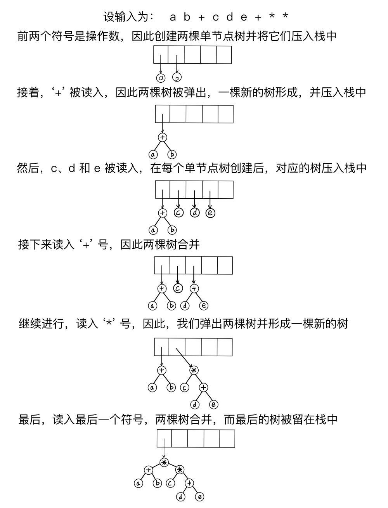

# 4 树
## 4.1 预备知识
### 4.1.1 树的定义
**树 (tree)** 可以用几种方式定义，定义树的一种自然的方式是递归。一棵树是一些节点的集合，这个集合可以是空集；若不是空集，则树由称作 **根 (root)** 的节点 r 以及 0 个或多个非空的 (子) 树组成，这些子树中每一棵的根都被来自根 r 的一条有向的 **边 (edge)** 所连结。

每一棵子树的根叫做根 r 的 **儿子 (child)** ，而 r 是每一棵子树的根的 **父亲 (parent)** 。

在递归定义中可以发现，一棵树是 N 个节点和 N - 1 条边的集合，其中的一个节点叫作根。存在 N - 1 条边的结论是由下面的事实得出：**每条边都将某个节点连接到它的父亲，而除去根节点外每个节点都有一个父亲** 。

每一个节点可以有任意多个儿子，也可能是零个儿子。没有儿子的节点称为 **树叶 (leaf)** ；具有相同父亲的节点为 **兄弟 (siblings)** ；用类似的方法可以定义 **祖父 (grandparent)** 和 **孙子(grandchild)** 关系。

从节点 n<sub>1</sub> 到 n<sub>k</sub> 的 **路径 (path)** 定义为节点 n<sub>1</sub> ，n<sub>2</sub> ，... , n<sub>k</sub> 的一个序列，使得对于 1 ≤ i < k 节点 n<sub>i</sub> 是 n<sub>i + 1</sub> 的父亲。这条路径的 **长 (length)** 是为该路径上的边的条数，即 k - 1 。从每一个节点到它自己有一条长为 0 的路径。注意，在一棵树中从根到每个节点恰好存在一条路径。

对任意节点 n<sub>i</sub>，n<sub>i</sub> 的 **深度 (depth)** 为从根到 n<sub>i</sub> 的唯一的路径的长；因此，根的深度为 0 。n<sub>i</sub> 的 **高 (height)** 是从 n<sub>i</sub> 到一片树叶的最长路径的长；因此所有的树叶的高都是 0 。一棵树的高等于它的根的高。一棵树的深度等于它最深的树叶的深度；该深度总是等于这棵树的高。 

如果存在从 n<sub>1</sub> 到 n<sub>2</sub> 的一条路径，那么 n<sub>1</sub> 是 n<sub>2</sub> 的一位 **祖先 (ancestor)** ，而 n<sub>2</sub> 是 n<sub>1</sub> 的一个 **后裔 (descendant)** 。如果 n<sub>1</sub> ≠ n<sub>2</sub> ，那么 n<sub>1</sub> 是 n<sub>2</sub> 的一位 **真祖先 (proper ancestor)** ，而 n<sub>2</sub> 是 n<sub>1</sub> 的一个 **真后裔 (proper descendant)** 。

### 4.1.2 树的实现
在每一个节点除数据外还要保存一些链，使得该节点的每一个儿子都有一个链指向它。如果直接建立到各(子)节点直接的链接会浪费空间，解决方法是：将每个节点的所有儿子都放在树节点的链表中。

```java
class TreeNode{
    Object element;         // 数据
    TreeNode firstChild;    // 第一儿子
    TreeNode nextSibling;   // 下一兄弟
}
```



### 4.1.3 树的遍历及应用
树的流行用法之一就是在常用操作系统中的目录结构。假如要列出目录中所有文件的名字，输出格式是：深度为 d<sub>i</sub> 的文件将被 d<sub>i</sub> 次跳格(tab) 缩进后打印其名。算法伪码如下：

```java
// 列出分级文件系统中目录
// 递归
private void listAll(int depth){
1    printName(depth);
2    if(isDirectory()){
3        for each file c in this directory (for each child)
4            c.listAll(depth + 1);
     }
}

public void listAll(){
    // 为了显示根时不进行缩进，需要从深度 0 开始
    // 这里的深度是一个内部簿记变量，而不是主调例程能够期望知道的参数
    listAll(0);
}
```

上述遍历策略叫做 **先序遍历 (preorder traversal)** 。在先序遍历中，对节点的处理工作是在它的诸儿子节点被处理之前 (pre) 进行的。该程序运行时，第 1 行对每个节点恰好执行一次，因为每个名字只输出一次。由于第 1 行对每个节点最多执行一次，因此第 2 行也必然对每个节点执行一次。不仅如此，对于每个节点的每一个子节点第 4 行最后只能被执行一次。但是，儿子的个数恰好比节点的个数少 1 。最后，第 4 行每执行一次，for 循环就迭代一次，每当循环结束时再加上一次。因此，在每个节点上总的工作量是常数。如果有 N 个文件名需要输出，则运行时间就是 O(N) 。

另一种遍历树的常用方法是 **后序遍历 (postorder traversal)** 。在后序遍历中，一个节点处的工作是在它的诸儿子节点被计算后进行的。算法伪码如下：

```java
public int size(){
    int totalSize = sizeOfThisFile();

    if(isDirectory()){
        for each file c in this directory (for each child)
            totalSize += c.size();
    }

    return totalSize;
}
```

如果当前对象不是目录，那么 size 只返回它所占用的区块数。否则，被该目录占用的区块数将被加到在其所有子节点 (递归地) 发现的区块数中去。

## 4.2 二叉树
### 4.2.1 二叉树的定义
**二叉树 (binary tree)** 是一棵树，其中每个节点都不能有多于两个的儿子。二叉树的一个性质是一棵平均二叉树的深度比节点个数 N 小得多，这个性质有时很重要。分析表明，其平均深度为 O(N<sup>1/2</sup>) ，而对于特殊类型的二叉树，即 **二叉查找树 (binary search tree)** ，其深度平均值是 O(log N) 。最坏情况下，这个深度是可以大到 N - 1 。

### 4.2.2 二叉树的实现
因为一个二叉树节点最多有两个子节点，所以我们可以保存直接链接到它们的链。树节点的声明在结构上类似于双链表的声明，在声明中，节点就是由 element(元素) 的信息加上两个到其他节点的引用 (left 和 right) 组成的结构。

```java
class BinaryNode{
    Object element;     // 元素信息
    BinaryNode left;    // 左孩子
    BinaryNode right;   // 右孩子
}
```

当画树时，不要显式画出 null 链，具有 N 个节点的每一棵二叉树都将需要 N + 1 个 null 链。

### 4.2.3 例子：表达式树
**表达式树 (expression tree)** 的树叶是 **操作数 (operand)** ,如常数或变量名，而其他的节点为 **操作符 (operator)** 。我们可以通过递归计算左子树和右子树所得到的值应用在根处的运算符上而运算出表达式树的值。

1. **中序遍历 (inorder traversal)**
    * 递归地打印左表达式，然后打印根处的运算符，最后得到右表达式
2. **后序遍历 (postorder traversal)**
    * 递归地打印出左子树、右子树，然后打印运算符
3. **先序遍历 (preorder traversal)**
    * 先打印出运算符，然后递归地打印出右子树和左子树

#### 4.2.3.1 构造表达式树
一次一个符号地读入表达式。如果符号是操作数，那么就建立一个单节点树并将它推入栈中；如果符号是操作符，那么就从栈中弹出两棵树 T<sub>1</sub> 和 T<sub>2</sub> (T<sub>1</sub> 先弹出) 并形成一颗新的树，该树的根就是操作符，它的左、右儿子分别是 T<sub>2</sub> 和 T<sub>1</sub> 。然后将这棵新树压入栈中。



## 4.3 查找树 ADT —— 二叉查找树
二叉树的一个重要的应用是它们在查找中的使用。假设树中的每个节点存储一个整数(所有项互异)。使二叉树成为二叉查找树的性质是：对于树中的每个节点 X ，它的左子树中所有项的值小于 X 中的项，而它的右子树中所有项的值大于 X 中的项

根据树的递归定义，通常是递归地编写对二叉查找树的操作。因为二叉查找树的平均深度是 O(log N) ，所有不用担心栈空间被用尽。

二叉查找树要求所有的项都能排序，树中的两项总可以使用 compareTo 方法进行比较。注意我们不使用 equals 方法，而是根据两项相等当且仅当 compareTo 方法返回 0 来判断相等。

```java
// 二叉搜索树架构
public class BinarySearchTree<E extends Comparable<? super E>> {
    private static class BinaryNode<E> {
        BinaryNode(E theElement) {
            this(theElement, null, null);
        }

        BinaryNode(E theElement, BinaryNode<E> lt, BinaryNode<E> rt) {
            element = theElement;
            left = lt;
            right = rt;
        }

        E element;
        BinaryNode<E> left;
        BinaryNode<E> right;
    }

    private BinaryNode<E> root;

    public BinarySearchTree() {
        root = null;
    }

    public void makeEmpty() {
        root = null;
    }

    public boolean isEmpty() {
        return root == null;
    }

    public boolean contains(E x) {
        return contains(x, root);
    }

    public E findMin() {
        if (isEmpty()) throw new UnderflowException();
        return findMin(root).element;
    }

    public E findMax() {
        if (isEmpty()) throw new UnderflowException();
        return findMax(root).element;
    }

    public void insert(E x) {
        root = insert(x, root);
    }

    public void remove(E x) {
        root = remove(x, root);
    }

    public void printTree() {
        if (isEmpty())
            System.out.println("Empty tree");
        else
            printTree(root);
    }
    
    private boolean contains(E x, BinaryNode<E> t) {
        // 首先对是否空树进行测试，否则就会生成一个企图通过 null 引用访问数据域的 NullPointerException 异常。
        if (t == null)
            return false;

        int compareResult = x.compareTo(t.element);

        // 如果没找到就向子树进行递归调用
        if (compareResult < 0)
            return contains(x, t.left);
        else if (compareResult > 0)
            return contains(x, t.right);
        else
            return true;
    }

    // 递归实现
    private BinaryNode<E> findMin(BinaryNode<E> t) {
        if (t == null)
            return null;
        else if (t.left == null)
            return t;
        return findMin(t.left);
    }

    // 非递归实现
    private BinaryNode<E> findMax(BinaryNode<E> t) {
        if (t != null)
            while (t.right != null)
                t = t.right;

        return t;
    }

    private BinaryNode<E> insert(E x, BinaryNode<E> t) {
        if (t == null)
            return new BinaryNode<>(x, null, null);

        int compareResult = x.compareTo(t.element);

        if (compareResult < 0)
            t.left = insert(x, t.left);
        else if (compareResult > 0)
            t.right = insert(x, t.right);
        else
            ;
        return t;
    }

    // 该程序的效率并不高，因为它沿该树进行两趟搜索以查找和删除右子树中最小的节点
    
    // 如果删除的次数不多，通常使用的策略是懒惰删除 (lazy deletion)：
    //    当一个元素要被删除时，它仍留在树中，只是被标记为删除。
    //    这特别是在有重复项时很常用，因为此时记录出现频率数的域可以减 1
    //    如果树中的实际节点数和 “被删除” 的节点相同，那么树的深度预计只上升一个小的常数
    //    因此，存在一个与懒惰删除相关的非常小的时间消耗
    //    如果被删除的项时重新插入的，那么分配一个新单元的开销就避免了
    private BinaryNode<E> remove(E x, BinaryNode<E> t) {
        if (t == null)
            return t;

        int compareResult = x.compareTo(t.element);

        // 如果节点是一片树叶，那么它可以被立即删除
        // 如果节点有一个儿子，则该节点可以在其父节点调整自己的链以绕过该节点后被删除
        // 复杂的情况是处理具有两个儿子的节点，一般的删除策略是用其右子树的最小的数据代替该节点的数据并递归地删除那个节点
        // 因为右子树中的最小的节点不可能有左儿子，所以第二次 remove 要容易

        if (compareResult < 0)
            t.left = remove(x, t.left);
        else if (compareResult > 0)
            t.right = remove(x, t.right);
        else if (t.left != null && t.right != null) {
            t.element = findMin(t.right).element;
            t.right = remove(t.element, t.right);
        } else
            t = (t.left != null) ? t.left : t.right;
        return t;
    }

    private void printTree(BinaryNode<E> t) {
        if (t != null) {
            printTree(t.left);
            System.out.println(t.element);
            printTree(t.right);
        }
    }
}
```

### 4.3.1 平均情况分析
直观上，我们期望所有对树的操作都花费 O(log N) 时间，因为用常数时间在树中降低了一层，这样对其进行操作的树大致减少一半左右。因此所有操作的运行时间都是 O(d) ，其中 d 是包含所访问的项的节点的深度。

接下来证明 **树的所有节点的平均深度为 O(log N)** 。

一棵树的所有节点的深度的和称为 **内部路径长 (internal path length)** 。令 D(N) 是具有 N 个节点的某棵树 T 的内部路径长，D(1) = 0 。一棵 N 节点树由一棵 i 节点左子树和一棵 (N - i - 1) 节点右子树以及深度 0 处的一个根节点组成，其中 0 ≤ i < N ，D(i) 为根的左子树的内部路径长。但是在原树中，所有这些节点都要加深一度。同样的结论对于右子树也成立。因此得到递推关系：

=D(i)+D(N-i-1)+N-1.png)

如果所有子树的大小都等可能地出现，这对于二叉查找树是成立的(因为子树的大小值依赖于第一个插入到树中的元素的相对的秩(rank))，但对二叉树不成立。

=frac%7B2%7D%7BN%7D%5Bsum_%7Bj=0%7D%5E%7BN-1%7DD(j)%5D+N-1.png)

得到平均值为 D(N) = O(N log N) 。因此任意节点预期的深度为 O(log N) 。这个结果不完全正确，因为删除操作中，我们并不清楚是否所有的二叉查找树都是等可能出现的，特别是上述的删除算法有助于使得左子树比右子树深度深，因为我们总是用右子树的一个节点来代替删除的节点。我们可以通过随机选取右子树的最小元素或左子树的最大元素来代替被删除的元素以消除这种不平衡问题，这明显消除了偏向并使树保持平衡。 

如果向一棵树输入预先排好序的数据，那么一连串的插入操作将花费二次的时间，而链表实现的代价会非常巨大，此时的树也只由那些没有左儿子的节点组成。一种解决办法就是要有一个 **平衡 (balance)** 的附加结构条件：任何节点的深度均不得过深。

一般有两种方法处理这种情况：其一是使用平衡二叉树 AVL；其二是放弃平衡条件，但是每次操作后要使用一种规则对树结构进行调整以提高后续操作效率，在二叉查找树的情况下，对于任意单个操作我们不再保证 O(log N) 的时间界，但任意连续 M 次操作在最坏的情况下花费时间 O(M log N) 。

## 4.4 AVL 树
AVL (Adelson- Velskii 和 Landis) 树是 **带有平衡条件 (balance condition)** 的二叉查找树。这个平衡条件必须要容易保持且保证树的深度须是 O(log N) 。最简单的想法是要求左右子树具有相同的高度；另一种平衡条件是要求每个节点必须有相同高度的左右子树。如果空子树的高度定义为 -1 ，那么只具有 2<sup>k</sup> - 1 个节点的理想平衡树满足该条件。

一颗 AVL 树是其每个节点的左右子树高度差最多差 1 的二叉查找树。在高度为 h 的 AVL 树中，最少节点数 **S(h) = S(h - 1) + S(h - 2) + 1** ，函数 S(h) 与斐波那契数密切相关。

当进行插入操作时，我们可能会破坏原有的平衡特性，这时需要进行 **旋转 (rotation)** 做简单修正。在插入后只有那些从插入点到根节点的路径上的节点的平衡可能被改变，假设将必须重新平衡的节点叫做 a ，出现高度不平衡需要 a 的两棵子树的高度差 2 。这种不平衡可能出现在如下四种情况中：
* 对 a 的左儿子的左子树插入
* 对 a 的左儿子的右子树插入
* 对 a 的右儿子的左子树插入
* 对 a 的右儿子的右子树插入

第一种情况是插入发生在 “外边” 的情况 (左 - 左 / 右 - 右) ，该情况通过对树的一次 **单旋转** 完成调整；第二种情况是插入发生在 “内部” 的情况 (左 - 右 / 右 - 左) ，该情况通过 **双旋转** 完成调整。

```java
private static class AvlNode<E extends Comparable<? super E>> {
    AvlNode(E theElement) {
        this(theElement, null, null);
    }

    AvlNode(E theElement, AvlNode<E> lt, AvlNode<E> rt) {
        element = theElement;
        left = lt;
        right = rt;
    }

    E element;
    AvlNode<E> left;
    AvlNode<E> right;
    int height;

    private int height(AvlNode<E> t) {
        return t == null ? -1 : t.height;
    }

    private AvlNode<E> insert(E x, AvlNode<E> t) {
        if (t == null)
            return new AvlNode<>(x, null, null);

        int compareResult = x.compareTo(t.element);

        if (compareResult < 0)
            t.left = insert(x, t.left);
        else if (compareResult > 0)
            t.right = insert(x, t.right);
        else
            ;
        return balance(t);
    }

    private static final int ALLOWED_IMBALANCE = 1;

    private AvlNode<E> balance(AvlNode<E> t) {
        if (t == null)
            return t;

        if (height(t.left) - height(t.right) > ALLOWED_IMBALANCE)
            if (height(t.left.left) >= height(left.right))
                t = rotateWithLeftChild(t);
            else
                t = doubleWithLeftChild(t);

        if (height(t.right) - height(t.left) > ALLOWED_IMBALANCE)
            if (height(t.right.right) >= height(right.left))
                t = rotateWithRightChild(t);
            else
                t = doubleWithRightChild(t);

        t.height = Math.max(height(t.left), height(t.right)) + 1;
        return t;
    }

    private AvlNode<E> rotateWithLeftChild(AvlNode<E> k2) {
        // 记录根节点的左孩子
        AvlNode<E> k1 = k2.left;
        // 根节点的左子树改为根节点左孩子的右孩子
        // 这里传入节点和他原始的左孩子之间已经没有直接连接了
        k2.left = k1.right;
        // 记录的原根节点的左孩子的右孩子改为原根节点
        k1.right = k2;
        k2.height = Math.max(height(k2.left), height(k2.right)) + 1;
        k1.height = Math.max(height(k1.left), k2.height) + 1;
        // 返回新的根
        return k1;
    }

    private AvlNode<E> rotateWithRightChild(AvlNode<E> k1) {
        AvlNode<E> k2 = k1.right;
        k1.right = k2.left;
        k2.left = k1;
        k1.height = Math.max(height(k1.left), height(k1.right)) + 1;
        k2.height = Math.max(height(k2.right), k1.height) + 1;
        return k2;
    }

    private AvlNode<E> doubleWithLeftChild(AvlNode<E> k3) {
        // 根节点的左节点左旋
        k3.left = rotateWithRightChild(k3.left);
        // 根节点右旋
        return rotateWithLeftChild(k3);
    }

    private AvlNode<E> doubleWithRightChild(AvlNode<E> k1) {
        k1.right = rotateWithLeftChild(k1.right);
        return rotateWithRightChild(k1);
    }

    private AvlNode<E> remove(E x, AvlNode<E> t) {
        if (t == null)
            return t;

        int compareResult = x.compareTo(t.element);

        if (compareResult < 0)
            t.left = remove(x, t.left);
        else if (compareResult > 0)
            t.right = remove(x, t.right);
        else if (t.left != null && t.right != null) {
            t.element = findMin(t.right).element;
            t.right = remove(t.element, t.right);
        } else
            t = (t.left != null) ? t.left : t.right;
        return balance(t);
    }
}
```

## 4.5 伸展树
**伸展树 (splay tree)** 保证从空树开始连续 M 次对树的操作最多花费 O(M log N) 时间 。一般来说，当 M 次操作的序列总的最坏情形运行时间为 O(M f(N)) 时，我们就说它的摊还 (amortized) 运行时间为 O(f(N)) 。因此，一棵伸展树每次操作的摊还代价是 O(log N) 。

如果任意特定操作可以有最坏时间界 O(N) ，而我们仍要求一个 O(log N) 的摊还时间界，那么只要一个节点被访问，它就必须被移动。否则一旦发现一个深层的节点，我们就有可能不断对它进行访问。如果这个节点不改变位置，而每次访问又花费 O(N) ，那么 M 次访问将花费 O(M * N) 的时间。

伸展树的基本思想是：**当一个节点被访问后，它就要经过一系列 AVL 树的旋转被推到根上** 。另外，伸展树还不要求保留高度或平衡信息，因此它在某种程度上节省空间并简化代码。

### 4.5.1 实现伸展树的简单想法
单旋转：在访问路径上的每一个节点和它们的父节点实施旋转。这种实现只改善了一个节点访问花费的时间，没有明显改善 (原先) 访问路径上其他节点的状况

这个问题最简单的方法是考虑向初始的空树插入关键字 1，2，3 ... N 所形成的树，这棵树只由一些左儿子构成。访问 1 节点花费 N 个单元的时间；完成旋转后，对 2 节点的一次访问花费 N 个单元的时间；对 3 节点的访问花费 N - 1 个单元时间。以此类推，按序访问所有关键字的总时间为 Ω(N<sup>2</sup>) 。在它们都被访问后，该树转变回原始状态，而且我们可能重复这个访问顺序。

### 4.5.2 展开
展开 (splaying) 的思路类似于旋转的想法。

* 令 X 是访问路径上的一个 (非根) 节点
    * 如果 X 的父节点 P(X) 是树根，那么只要旋转 X 和树根。这就是沿着访问路径上的最后的旋转
    * 否则 X 就有父亲 P(X) 和祖父 G(X) ，存在两种情况
        * 之字形 (zig - zag)：如果 P(X) 不是树根，而且 X 是左孩子，P(X) 是右孩子，或者相反，则先旋转连接 X 和 P(X) 的边，再旋转连接 X 和新的 P(X) 的边
        * 一字形 (zig - zig)：如果 P(X) 不是树根，而且 X 和 P(X) 本身都是左孩子或者都是右孩子，则先旋转连接 P(X) 和 X 的祖父节点 G(X) 的边，然后再旋转连接 X 和 P(X) 的边

当访问路径长而导致超出正常查找时间时，这些旋转将对未来的操作有益。当访问耗时很少时，这些旋转则不那么有益甚至有害。极端的情形时经过若干插入操作而形成的初始树。所有的插入都是导致坏的初始树的花费常数时间的操作。此时我们会得到一棵很差的树，但是运行却比预计的快，从而总的较少运行时间补偿了损失。

可以通过访问要被删除的节点来执行删除操作。这种操作将节点上推到根处。如果删除该节点，则得到两棵子树 T<sub>L</sub> 和 T<sub>R</sub> (左子树和右子树) 。如果我们找到 T<sub>L</sub> 中的最大的元素，那么这个元素就被旋转到  T<sub>L</sub> 的根下，而此时 T<sub>L</sub> 将有一个没有右儿子的根。我们可以使 T<sub>R</sub> 为右儿子从而完全删除。

## 4.6 再探树的遍历
中序遍历遍历树会按照左子树，当前节点，右子树的顺序简单遍历，其总运行时间是 O(N) 。有时我们需要先处理两棵子树后才能处理当前节点，即后序遍历，例如计算一个节点的高度需要首先知道它的子树的高度，其总运行时间也是 O(N) 。有时我们需要用深度标记每一个节点，就要用到先序遍历。

上述遍历都有共同的想法，即首先处理 null 的情形，然后才是其余的工作。这些例程仅仅传递对作为子树的根的节点的引用，并没有声明或是传递任何附加的变量。

除了以上三种遍历，还有第四种 —— 层序遍历，在层序遍历中，所有深度为 d 的节点要在深度 d + 1 的节点之前进行。比起其他遍历方式的递归执行，层序遍历用到的是队列而非递归所默示的栈。

## 4.7 B 树
先前我们始终假设可以将整个数据结构存储到计算机的主存中，可是当数据更多时意味着必须把数据结构放到磁盘上。我们愿意进行大量的计算以节省磁盘访问的高代价。

我们若想将磁盘访问的次数减小到一个很小的常数，可以建立一棵 M 叉查找树。随着分支的增加，树的深度在减少。为了防止它退化成链表，我们将使用 B 树实现上述想法。

**阶为 M 的 B 树是一棵具有下列特性的树** (这里描述的是 B + 树)：
1. 数据项存在叶子上
2. 非叶子节点存储直到 M - 1 个关键字以指示搜索的方向；关键字 i 代表子树 i + 1 中的最小的关键字
3. 树的根或者是一片树叶，或者其儿子数在 2 和 M 之间
4. 除根外，所有非树叶节点的儿子数在 [M / 2] 和 M 之间
5. 所有的树叶都在相同深度上并有 [L / 2] 和 L 之间个数据项

### B 树的插入
* 树叶未满时直接插入
* 树叶满时，由于存在 L + 1 项，则将树叶分成两片 —— 增加高度的唯一方式
    * 分裂节点至少需要两次附加的磁盘写，但是它相对很少发生
    * 每次分裂大致存在 L / 2 次非分裂的插入
* 还可以在相邻节点有空间时将过多儿子中的一个交给该邻空间领养
    * 这种方法要求对父节点进行修改，因为有些关键字收到了影响
    * 然而，它趋向于使得节点更满，从而长时间运行中节省空间

### B 树的删除
* 如果相邻节点已经达到最小值，那么可以与该相邻节点联合以形成一片满叶子
    * 如果父节点失去儿子的结构引起父节点儿子数低于最小值，需要递归向上处理到根
    * 如果领养过程的结果使得根只剩下一个儿子，那么删除该根让儿子作为新的根 —— 降低高度的唯一方式

## 4.8 标准库中的集合与映射
### 4.8.1 Set 接口
Set 接口代表不允许重复元的 Collection。由接口 SortedSet 给出的一种特殊类型的 Set 保证其中的各项处于有序的状态。由 Set 所要求的一些独特的操作是一些插入、删除以及(有效地)执行基本查找的能力。add 方法如果执行成功返回 true，如果被添加的项已经存在则插入失败返回 false 。

保持各项以有序状态的 Set 的实现是 TreeSet 。它的基本操作花费对数最坏情形时间。默认情况下，排序假设 TreeSet 中的项实现 Comparable 接口。另一冲排序可以通过 Comparator 实例化 TreeSet 来确定。

```
Set<String> s = new TreeSet<>(继承 Comparator 忽略大小写的接口);
s.add("Hello");
s.add("hELLO");
System.out.println("The size is:" + s.size());  // s 的大小为 1
```

### 4.8.2 Map 接口
Map 是一个接口，代表由关键字以及它们的值组成的一些项的集合。关键字必须是唯一的，但是若干关键字可以映射到一些相同的值。因此，值不必是唯一的。在 SortedMap 接口中，映射中的关键字保持逻辑上有序状态。SortedMap 接口的一种实现是 TreeMap 类。Map 的基本操作包括诸如 isEmpty、clear、size 等方法，而最重要的是下面几个：

```java
boolean containsKey(KeyType key);
ValueType get(KeyType key);
ValueType put(KeyType key,ValueType value);
```

get 返回 Map 中与 key 相关的值、或当 key 不存在时返回 null 。如果在 Map 中不存在 null 值，那么由 get 返回的值可以用来确定 key 是否在 Map 中。然而如果存在 null 值，那么必须使用 containKey 。方法 put 把关键字/键值对置入 Map 中，或者返回 null，或者返回与 key 相联系的老值。

通过一个 Map 进行迭代要比 Collection 复杂，因为 Map 不提供迭代器，而是提供三种方法，将 Map 对象的视图作为 Collection 对象返回。由于这些视图本身就是 Collection ，因此它们可以被迭代。三种方法如下：

```java
Set<KeyType> keySet()
Collection<ValueType> values()
Set<Map.Entry<KeyType,ValueType>> entrySet()
```

方法 keySet 和 values 返回简单的集合 (这些关键字不包含重复元，因此以一个 Set 对象的形式返回)。这里的 entrySet 方法是作为一些项而形成的 Set 对象被返回的 (由于关键字是唯一的，因此不存在重复项) 。每一项均由被嵌套的接口 Map.Entry 表示。对于类型 Map.Entry 的对象，其现有的方法包括访问关键字、关键字的值，以及改变关键字的值。

```java
KeyType getKey()
ValueType getValue()
ValueType setValue(ValueType new Value)
```

### 4.8.3 TreeSet 类和 TreeMap 类的实现
TreeSet 和 TreeMap 需要支持基本的 add、remove、contains 操作以对数最坏情形时间完成。因此基本的实现方法就是平衡二叉查找树。一般来说，我们并不使用 AVL 树，而是经常使用一些自顶向下的红黑树。实现 TreeSet 和 TreeMap 的一个重要问题是提供对迭代器类的支持。在内部，迭代器保留到迭代中 “当前” 节点的一个链接。困难部分是到下一个节点高效的推进。解决方案如下：
1. 在构造迭代器时，让每个迭代器把包含诸 TreeSet 项的数组作为该迭代器的数据存储。
    * 这有不足，因为我们还可以使用 toArray，并不需要迭代器。
2. 让迭代器保留存储通向当前节点的路径上的节点的一个栈。
    * 根据该信息，可以推出迭代器中的下一个节点，它或者是包含最小项的当前节点右子树上的节点，或者包含其左子树当前节点的最近祖先。
    * 这使得迭代器多少有些大，并导致迭代器的代码臃肿。
3. 让查找树中的每个节点除存储子节点外还要存储它的父节点。
    * 此时迭代器不至于那么大，但是在每个节点上需要额外的内存，并且迭代器的代码依然臃肿。
4. 让每个节点保留两个附加的链：一个通向下一个更小的节点；另一个通向下一个更大的节点。
    * 这要占空间，不过迭代器做起来非常简单，并且保留这些链很容易。
5. 只对那些具有 null 左链或 null 右链的节点保留附加的链。通过使用附加的布尔变量使得这些例程判断是一个左链正在被用作标准的二叉树左链还是一个通向下一个更小节点的链，类似地，对右链也有类似的判断。
    * 这种做法叫做线索树，用于许多平衡二叉查找树的实现中。

### 4.8.4 使用多个映射的实例
有很多英文单词和另一些单词相似，通过变换其中的几个字母就可以产生许多不同的单词。现在我们想要编写一个程序以找出通过单个字母的替换可以变成至少 15 个其他单词的单词。假设我们有一个包含 89000 个不同长度不同单词的词典，其中大部分单词在 6 ~ 11 个字母之间。

#### 4.8.4.1 思路 1
最直截了当的策略是使用一个 Map 对象，其中的关键字 key 是单词，而值 value 是用 1 字母替换能够从关键字变换得到的一列单词。例程显示最后得到的 Map 如何打印要求的所有答案。

```java
// 给出包含一些单词作为关键字和旨在一个字母上不同的一列单词作为关键字的值
// 输出那些具有 minWords 个或更多个通过 1 字母替换得到的单词的单词
public static void printHighChangeables(Map<String, List<String>> adjWords, int minWords) {
    for (Map.Entry<String, List<String>> entry : adjWords.entrySet()) {
        List<String> words = entry.getValue();

        if (words.size() >= minWords) {
            System.out.println(entry.getKey() + "(");
            System.out.println(words.size() + "):");
            for (String w : words) {
                System.out.println(" " + w);
            }
            System.out.println();
        }
    }
}
```

主要的问题是如何从包含 89000 个单词的数组构造 Map 对象。例程测试除一个字母替换外两个字母是否相等的函数。

```java
// Return true if word1 and word2 are the same length and differ in only one character
private static boolean oneCharOff(String word1, String word2) {
    if (word1.length() != word2.length())
        return false;

    int diffs = 0;
    for (int i = 0; i < word1.length(); i++) {
        if (word1.charAt(i) != word2.charAt(i))
            if (++diffs > 1)
                return false;
    }
    return diffs == 1;
}
```

我们可以使用下面的例程提供最简单的 Map 构造算法，它是所有单词序偶的蛮力测试。

```java
// 计算一个 Map 对象的函数，该对象以一些单词作为关键字而以只在一个字母处找不同的一列单词作为关键字的值
public static Map<String, List<String>> computeAdjacentWords(List<String> theWords) {
    Map<String, List<String>> adjWords = new TreeMap<>();

    // 使用 toArray 将该集合转储到一个数组
    // 避免重读调用以使从 Object 向 String 转化
    String[] words = new String[theWords.size()];
    theWords.toArray(words);
    
    for (int i = 0; i < words.length; i++) {
        for (int j = i + 1; j < words.length; j++) {
            // 如果只有一个字母不同就更新该 Map 对象
            if (oneCharOff(words[i], words[j])) {
                update(adjWords, words[i], words[j]);
                update(adjWords, words[j], words[i]);
            }
        }
    }
    return adjWords;
}

private static <KeyType> void update(Map<KeyType, List<String>> m, KeyType key, String value) {
    List<String> lst = m.get(key);
    if (lst == null) {
        lst = new ArrayList<>();
        m.put(key, lst);
    }
    lst.add(value);
}
```

上述算法的问题在于速度慢，对一个 89000 单词的词典需要运行 75 秒。一个明显的改进是避免比较不同长度的单词。我们可以把单词按照长度分组，然后对各个分组运行上述程序。

#### 4.8.4.2 思路 2
换一种映射想法：关键字 key 是单词长度，值 value 是该长度的所有单词的集合。我们可以使用一个 List 存储每个集合，然后应用相同的做法。

```java
// 计算一个映射的函数，该映射以单词作为关键字并且以只有一个字母不同的一列单词作为关键字的值。将单词按照长度分组。
public static Map<String, List<String>> computeAdjacentWords2(List<String> theWords) {
    Map<String, List<String>> adjWords = new TreeMap<>();
    Map<Integer, List<String>> wordsByLength = new TreeMap<>();

    for (String w : theWords) {
        update(wordsByLength, w.length(), w);
    }

    for (List<String> groupsWords : wordsByLength.values()) {
        String[] words = new String[groupsWords.size()];

        groupsWords.toArray(words);
        for (int i = 0; i < words.length; i++) {
            for (int j = i + 1; j < words.length; j++) {
                if (oneCharOff(words[i], words[j])) {
                    update(adjWords, words[i], words[j]);
                    update(adjWords, words[j], words[i]);
                }
            }
        }
    }

    return adjWords;
}
```

与思路 1 相比，思路 2 在边际上编程困难，但运行时间大幅缩短，约为 16 秒，快了约 5 倍。

#### 4.8.4.3 思路 3
