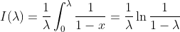

# 5 散列
## 5.1 散列的基本思想
理想的散列表数据结构是一个包含一些项的具有固定大小的数组。项可以由一个串 (可以作为关键字) 和其他一些数据域组成。我们把表的大小记作 TableSize ，并将其作为散列的一部分。

散列中，每个关键字被映射到从 0 到 TableSize - 1 这个范围中的某个数，并且被放到适当的单元中，这个映射就叫做散列函数 (hash function) ，理想情况下它的计算很简单，并且应该保证任何两个不同的关键字映射到不同的单元。但这是不可能的，因为单元的数目是有限的，而关键字是用不完的。

我们需要寻找一个散列函数，该函数要在单元之间均匀地分配关键字，还要处理当两个关键字散列到同一值 (即冲突) 时应该如何处理以及如何确定散列表的大小。

## 5.2 散列函数
如果关键字是整数，则一般合理的方法就是直接返回 ``Key mod TableSize`` 。这种情况下，散列函数需要仔细考虑，例如：若 TableSize = 10 而关键字都以 0 为个位时，上述标准的散列函数计算结果无法实现均匀分配。为了避免这样的情况，TableSize 通常为素数。

如果关键字是字符串，有几种散列函数可供选择：
1. 把字符串中字符的 ASCII 码 (或 Unicode 码) 值相加

   ```java
   public static int hash(String key, int tableSize) {
       int hashVal = 0;
   
       for (int i = 0; i < key.length(); i++) {
           hashVal += key.charAt(i);
       }
   
       return hashVal % tableSize;
   }
   ```
   
   上述散列函数实现简单而且能很快计算出答案。但是当表很大时，该函数就无法很好地尽可能均匀分配。假设 TableSize = 10007 ，且所有关键字至多 8 个字符长。由于 ASCII 码的值最多是 127 ，因此散列函数只能假设值在 0 ~ 1016 之间。这显然不是一种均匀的分配。
2. 假设 Key 至少有 3 个字符，值 27 代表英文字母外加一个空格的个数。

   ```java
   public static int hash(String key, int tableSize) {
       return (key.charAt(0) + 27 * key.charAt(1) + 27 * 27 * key.charAt(2)) % tableSize;
   }
   ```
   
   假如前三个字符是随机的，表大小 10007 ，那么得到的分布是较合理的。但是三个字符虽然有 26<sup>3</sup> 种可能组合，但是实际合法的不同的组合数只有 2851 。即使这些组合没有冲突，也只有表的 28% 被真正散列到。
3. 涉及到关键字中的所有字符，根据 Horner 法则计算一个多项式函数，并将结果限制在适当的范围内。

   ```java
   public static int hash(String key, int tableSize) {
       int hashVal = 0;
   
       for (int i = 0; i < key.length(); i++) {
           hashVal = 37 * hashVal + key.charAt(i);
       }
   
       hashVal %= tableSize;
   
       return hashVal < 0 ? hashVal + tableSize : hashVal;
   }
   ```
   
   这个散列函数利用到事实：允许溢出。这可能会引进负数，因此在末尾有附加测试。
   该散列函数就表的分布而言未必是最好的，但极其简单且速度很快。如果关键字特别长，可以挑选其中一部分或只挑选某些位置的字符进行计算，用计算散列函数节省下来的时间来补偿由此产生的对均匀分布的函数的轻微干扰。

## 5.3 分离链接法
**分离链接法 (separate chaining)** 的做法是将散列到同一个值的所有元素保留在一个链表中。如果执行查找，我们需要先通过散列函数确定要遍历哪个链表，在在被确定的链表中进行查找；如果执行插入，我们需要检查相应的链表并将它插在链表头部。

```java
// 分离链接散列表
public class SeparateChainingHashTable<E> {
    public SeparateChainingHashTable() {
        this(DEFAULT_TABLE_SIZE);
    }

    public SeparateChainingHashTable(int size) {
        // 表的大小取素数
        theLists = new LinkedList[nextPrime(size)];
        for (int i = 0; i < theLists.length; i++) {
            theLists[i] = new LinkedList<>();
        }
    }

    public void insert(E x) {
        List<E> whichList = theLists[myhash(x)];
        if (!whichList.contains(x)) {
            // 如果被插入的项已经存在就不执行操作
            whichList.add(x);
            
            if (++currentSize > theLists.length)
                rehash();
        }
    }

    public void remove(E x) {
        List<E> whichList = theLists[myhash(x)];
        if (whichList.contains(x)) {
            whichList.remove(x);
            currentSize--;
        }
    }

    public boolean contains(E x) {
        List<E> whichList = theLists[myhash(x)];
        return whichList.contains(x);
    }

    public void makeEmpty() {
        for (int i = 0; i < theLists.length; i++) {
            theLists[i].clear();
        }
        currentSize = 0;
    }

    private static final int DEFAULT_TABLE_SIZE = 101;

    private List<E>[] theLists;
    private int currentSize;

    private void rehash() {
    }

    private int myhash(E x) {
        int hashVal = x.hashCode();

        hashVal %= theLists.length;
        return hashVal < 0 ? hashVal + theLists.length : hashVal;
    }

    private static int nextPrime(int n) {
        if (n < 2)
            return 2;
        while (!isPrime(++n)) {
        }
        return n;
    }

    private static boolean isPrime(int n) {
        if (n < 2)
            return false;
        else if (n > 2) {
            long len = (long) Math.sqrt(n);
            for (long i = 2; i <= len; i++) {
                if (n % i == 0)
                    return false;
            }
        }
        return true;
    }
}
```

我们定义散列表的 **装填因子 (load factor) λ** 为散列表汇总元素个数和表大小之比。上述例子中，λ = 1.0 。链表的平均长度为 λ 。执行一次查找所需要的工作是计算散列函数值所需要的常数时间加上遍历链表所用的时间。在一次不成功的查找中，要考察的节点数平均为 λ ；一次成功的查找需要遍历大约 1 + (λ/2)<sup>1/2</sup > 个链。可以看出散列表的大小其实并不重要，更重要的是装填因子。分离链接散列法的一般法则是使得表的大小与预料的元素个数大致相等 (λ ≈ 1) 。当装填因子超过 1 时，我们需要通过 rehash 函数扩大散列表的大小，后续会展开说明。


## 5.4 不用链表的散列表
分离链接散列算法的缺点是使用链表时，由于给新单元分配地址需要时间，导致算法的速度有些缓慢。另一种不用链表解决冲突的方法是尝试另外一些单元，直到找出空的单元为止。更常见的是，单元 h<sub>0</sub>(x) ,h<sub>1</sub>(x) ,h<sub>2</sub>(x) ... 相继被试选，其中 h<sub>i</sub>(x) = (hash(x) + f(i)) mod TableSize ,且 f(0) = 0 。函数 f 是冲突解决方法。因为所有的数据都要置入表内，所以这种解决方案所需要的表要比分离链接散列的表大。一般来说，对于不使用分离链接的散列表来说，其装填因子应该低于 λ = 0.5 。我们把这样的表叫做 **探测散列表 (probing hash table)** 。

### 5.4.1 线性探测法
在线性探测法中，函数 f 是 i 的线性函数，典型情形是 f(i) = i 。这相当于相继探测逐个单元 (必要时可以回绕) 以查找出一个空单元。只要表足够大，总能够找到一个自由单元，但是如此花费的时间相当多。更糟的是即使表相对较空，这样占据的单元也会开始形成一些区块，其结果称为 **一次聚集 (primary clustering)** ，就是说，散列到区块中的任何关键字都需要多次试选单元才能够解决冲突，然后该关键字被添加到相应的区块中。

可以证明使用线性探测的预期预测次数对于插入和不成功的查找来说大约为 1/2 (1 + 1 / (1 - λ)<sup>2</sup>) ，而对于成功的查找来说则是 1/2 (1 + 1 / (1 - λ)) 。

一次成功查找的探测次数等于该特定元素插入时所需要的探测次数。当一个元素被插入时，可以看成进行一次不成功查找的结果。因此，我们可以使用一次不成功查找的开销来计算一次成功查找的平均开销。

需要指出的是，λ 从 0 到当前值之间变化，因此早期的插入操作开销较少，从而将平均开销拉低。我们可以通过使用积分计算插入时间平均值的方法来估计平均值，如此得到：



如果 λ = 0.75 ，上面的公式指出在线性探测中一次插入预计 8.5 次探测。如果 λ = 0.9 ，则预计为 50 次探测。假如聚集不是问题，那么这可与相应的装填因子的 4 次和 10 次探测相比。从这些公式看到，如果表可以有多于一半被填满的话，那么线性探测就不是个好办法。然而如果 λ = 0.5 ，那么插入操作平均只需要 2.5 次探测，并且对于成功的查找平均只需要 1.5 次探测。

### 5.4.2 平方探测法
平方探测是消除线性探测中一次聚集问题的冲突解决方法。平方探测就是冲突函数为二次的探测方法。流行的选择是 f(i) = i<sup>2</sup> 。对于线性探测，让散列表几乎填满元素并不是一个好主意，因为此时表的性能会降低。对于平方探测情况甚至更糟：一旦表被填充超过一半，当表的大小不是素数时甚至在表被填充一半之前，就不能保证一次找到空的单元了。这是因为最多有表的一半可以用作解决冲突的备选位置。

很容易证明：如果使用平方探测，且表的大小是素数，那么当表至少有一半是空的时候，总能够插入一个新的元素

在探测散列表中标准的删除操作不能执行，因为相应的单元可能已经引起过冲突，元素绕过它存在了别处。因此，探测散列表需要懒惰删除，不过在这种情况下实际上并不存在所谓的懒惰。

探测散列表架构如下：

```java
public class QuadraticProbingHashTable<E> {
    public QuadraticProbingHashTable() {
        this(DEFAULT_TABLE_SIZE);
    }

    public QuadraticProbingHashTable(int size) {
        allocateArray(size);
        makeEmpty();
    }

    public void makeEmpty() {
        currentSize = 0;
        for (int i = 0; i < array.length; i++) {
            array[i] = null;
        }
    }


    public boolean contains(E x) {
        int currentPos = findPos(x);
        return isActive(currentPos);
    }

    public void insert(E x) {
        int currentPos = findPos(x);
        if (isActive(currentPos))
            return;

        array[currentPos] = new HashEntry<>(x, true);

        // 如果装填因子超过 0.5 ，需要将散列表放大
        if (currentSize > array.length / 2)
            rehash();
    }

    public void remove(E x) {
        int currentPos = findPos(x);
        if (isActive(currentPos))
            array[currentPos].isActive = false;
    }

    private static class HashEntry<E> {
        public E element;
        public boolean isActive;

        public HashEntry(E e) {
            this(e, true);
        }

        public HashEntry(E e, boolean i) {
            element = e;
            isActive = i;
        }
    }

    private static final int DEFAULT_TABLE_SIZE = 11;

    private HashEntry<E>[] array;
    private int currentSize;

    private void allocateArray(int arraySize) {
        array = new HashEntry[nextPrime(arraySize)];
    }

    private boolean isActive(int currentPos) {
        return array[currentPos] != null && array[currentPos].isActive;
    }

    private int findPos(E x) {
        int offset = 1;
        int currentPos = myhash(x);

        while (array[currentPos] != null &&
                !array[currentPos].element.equals(x)) {
            // f(i) = f(i - 1) + 2i -1
            // 因此下一个要探测的单元离上一个被探测过的单元有一段距离，而这个距离在连续探测中增 2
            currentPos += offset;
            offset += 2;
            // 如果新的定位越过数组，那么可以通过减去 TableSize 把它拉回数组范围内
            if (currentPos >= array.length)
                currentPos -= array.length;
        }

        return currentPos;
    }

    private void rehash() {
    }


    private int myhash(E x) {
        int hashVal = x.hashCode();

        hashVal %= theLists.length;
        return hashVal < 0 ? hashVal + theLists.length : hashVal;
    }

    private static int nextPrime(int n) {
        if (n < 2)
            return 2;
        while (!isPrime(++n)) {
        }
        return n;
    }

    private static boolean isPrime(int n) {
        if (n < 2)
            return false;
        else if (n > 2) {
            long len = (long) Math.sqrt(n);
            for (long i = 2; i <= len; i++) {
                if (n % i == 0)
                    return false;
            }
        }
        return true;
    }
}
```

虽然平方探测排除了一次聚集，但是散列到同一位置上的那些元素将探测相同的备选单元。这叫做 **二次聚集 (secondary clustering)** 。二次聚集是理论上一个小缺憾。模拟结果指出，对每次查找，它一般要引起另外的少于一半的探测。想要排除这个缺憾，需要付出计算一个附加散列函数的代价。

## 5.5 再散列
对于使用平方探测的开放定址散列法，如果散列表填得太满，那么操作的运行时间将开始消耗过长，且插入操作可能失败。这可能发生在有太多的移动和插入混合的场合。此时，一种解决方法是建立另外一个大约两倍大的表 (而且使用一个相关的新散列函数) ，扫描整个原始散列表，计算每个 (未删除的) 元素的新散列值并将其插入到新表中。

**再散列 (rehashing)** 是一种开销非常大的操作，其运行时间为 O(N) ，因为有 N 个元素要再散列而表的大小约为 2N ，不过该操作并不是经常发生，所以实际效果并不差。特别是在最后的再散列之前必然已经存在 N/2 次 insert，因此添加到每个插入上的花费基本上是一个常数开销。如果这种数据结构是程序的一部分，那么其影响是不明显的；另一方面，如果再散列作为交互系统的一部分运行，那么其插入引起再散列的不幸用户将会感到速度减慢。

再散列可以用平方探测以多种方法实现。一种做法是只要表满到一半就再散列；另一种极端的方法是只有当插入失败时才再散列；第三种方法即途中策略：当散列表达到某一个装填因子时进行再散列。由于随着装填因子的增长散列表的性能确实下降，因此以好的截止手段实现的第三种策略，可能是最好的策略。

```java
private void rehash() {
    HashEntry<E>[] oldArray = array;

    // 创建一个两倍长度的空表
    allocateArray(nextPrime(2 * oldArray.length));
    currentSize = 0;

    // 复制表
    for (int i = 0; i < oldArray.length; i++) {
        if (oldArray[i] != null && oldArray[i].isActive)
            insert(oldArray[i].element);
    }
}
```

```java
private void rehash() {
    List<E>[] oldLists = theLists;

    theLists = new List[nextPrime(2 * theLists.length)];
    for (int j = 0; j < theLists.length; j++) {
        theLists[j] = new LinkedList<>();
    }

    currentSize = 0;
    for (int i = 0; i < oldLists.length; i++) {
        for (E item : oldLists[i]) {
            insert(item);
        }
    }
}
```

## 5.6 标准库中的散列表
标准库包括 Set 和 Map 的散列表的实现，即 HashSet 类和 HashMap 类。HashSet 中的项必须提供 equals 方法和 hashCode 方法。HashSet 和 HashMap 通常是用分离链接散列实现的。

HashMap 的性能常常优于 TreeMap 的性能，在 HashMap 或 TreeMap 可以接受的情况下更可取的方法是：使用接口类型 Map 进行变量的声明，然后将 TreeMap 的实例变成 HashMap 的实例并进行计时测试。

在 Java 中，能够被合理地插入到一个 HashSet 中去或是所谓关键字被插入到 HashMap 中去的那些库类型已经被定义了 equals 和 hashCode 方法。特别是 String 类中有一个 hashCode 方法。

因为散列表操作中费时多的部分就是计算 hashCode 方法，所以在 String 类中的 hashCode 方法包含一个重要的优化：每个 String 对象内部都存储它的 hashCode 值。该值初始为 0，但若 hashCode 被调用，那么这个值就被记住。因此，如果 hashCode 对同一个 String 对象被第二次计算，我们可以避免昂贵的重新计算。这个技巧叫作 **闪存散列代码 (caching the hash code)** ，并且表示另一种经典的时空交换。下面显示闪存散列代码的 String 类的一种实现：

```java
public final class String {
    public int hashCode() {
        if (hash != 0)
            return hash;

        for (int i = 0; i < length(); i++) {
            hash = hash * 31 + (int) charAt(i);
        }

        return hash;
    }
    
    private int hash = 0;
}
```

闪存散列代码之所以有效，只是因为 String 类是不可改变的：要是 String 允许变化，那么它就会使 hashCode 无效，而 hashCode 就只能重置回 0 。虽然两个具有相同状态的 String 对象的 hashCode 必须独立计算，但是存在许多情况使同一个 String 对象的散列代码总是被查询。闪存散列代码都用的一种情况是在再散列期间发生，因为在再散列中所涉及的所有 String 对象的散列代码都已经闪存过。

## 5.7 最坏情况下 O(1) 访问的散列表
目前讨论过的散列表都具有的性质是：当有合理的装填因子和合适的散列函数时，可以期望插入、删除和查找的平均花销都是 O(1) 。但在假设散列函数表现良好的前提下，查找的最坏情形的期望值如下：

对分离链接法而言，假设装填因子为 1 ，这就是经典的 **球盒问题** 的一个版本：给定 N 个球，(均匀) 随机地放在 N 个盒子里，在装球最多的盒子里，球的个数的期望值是多少？答案是著名的 O(log N / log log N) ，意即平均而言，我们期望部分查询会花费近乎对数级的时间。对于探测散列表中的最长期望探测序列，也可观察到类似类型的上界。

想要得到 O(1) 的最坏情形的花销。假设我们事先知道 N 的值，于是不需要再散列。如果我们可以在插入的过程中重新排列各项，则查找的 O(1) 最坏情形花销是可以达到的。

### 5.7.1 完美散列
完美散列的基本思想是利用两级的哈希策略，而每一级上都使用全域哈希。

第一级与链接哈希表基本上是一样的，而第二级为散列表而非链表。通过随机的选取哈希函数 h<sub>j</sub> ，可以确保在第二级上不出现哈希冲突。

如果利用从一个全域哈希函数族中随机选择的哈希函数 h，将 n 个关键字存储在一个大小为 m = n<sup>2</sup> 的哈希表中，那么出现碰撞的概率小于 1/2 。

为了确保第二级上不出现哈希冲突，需要让哈希表 S<sub>j</sub> 的大小 m<sub>j</sub> 为哈希到槽 j 中的关键字数 n<sub>j</sub> 的平方。m<sub>j</sub> 对 n<sub>j</sub> 的这种二次依赖关系看上去可能使得总体存储需求很大，但通过适当地选择第一次哈希函数，预期使用的的总存储空间仍为 O(n)。

### 5.7.2 布谷鸟散列