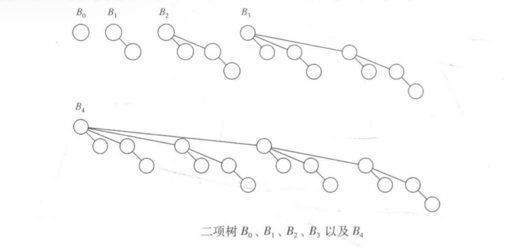

# 6 优先队列(堆)

## 6.1 模型
优先队列是允许至少下列两种操作的数据结构：insert、deleteMin 。其中 deleteMin 的工作是找出、返回并删除优先队列中最小的元素。insert 操作等价于 enqueue (入队) ，而 deleteMin 则是队列运算 dequeue (出队) 在优先队列中的等价操作。

## 6.2 一些简单的实现
有几种明显的办法可用于实现优先队列。我们可以使用一个简单链表在表头以 O(1) 执行插入操作，并遍历该链表以删除最小元，这又需要 O(N) 时间；另一种方法是始终让链表保持排序状态：这使得插入代价高昂 (O(N)) 而 deleteMin 花费低廉 (O(1)) 。

另一种实现优先队列的方法是使用二叉查找树，它对这两种操作的平均运行时间都是 O(log N) 。尽管插入是随机的，而删除则不是，但这个结论还是成立的。记住我们删除的唯一元素是最小元。反复取出左子树中的节点似乎会损害树的平衡，使得右子树加重。然而右子树是随机的。在最坏的情况下，即 deleteMin 将左子树删空的情形下，右子树拥有的元素最多也就是它应具有的两倍。这只是在期望的深度上加了一个小常数。注意，通过使用一棵平衡树，可以把这个界变成最坏情形的界：这将防止出现坏的插入序列。

使用查找树可能有些过分，因为它支持许许多多并不需要的操作。我们将要使用的基本的数据结构不需要链，它以最坏情形时间 O(log N) 支持上述两种操作。插入操作实际上将花费常数平均时间，若无删除操作的干扰，该结构的实现将以线性时间建立一个具有 N 项的优先队列。然后，我们将讨论如何实现优先队列以支持有效的合并。这个附加的操作似乎有些复杂，它显然需要使用链接的结构。

## 6.3 二叉堆
**二叉堆 (binary heap)** 的使用对于优先队列的实现相当普遍，以至于当堆 (heap) 这个词不加修饰地用优先队列的上下文时，一般都是指数据结构的这种实现。像二叉查找树一样，堆也有两个性质，即结构性和堆序性。恰似 AVL 树，对堆的一次操作可能破坏这两个性质中的一个，因此堆的操作必须到堆的所有性质都被满足时才能终止。

### 6.3.1 结构性质
堆是一棵被完全填满的二叉树，有可能的例外是在底层，底层上的元素从左到右填入。容易证明的是，一棵高为 h 的完全二叉树有 2<sup>h</sup> 到 2<sup>h + 1</sup> - 1 个节点，这意味着完全二叉树的高是 log N ，显然它是 O(log N) 。

由于完全二叉树这样的规律，所以它可以用一个数组表示而不需要使用链。对于数组中任一位置 i 上的元素，其左儿子在位置 2i 上，右儿子在左儿子后的单元 (2i + 1) 中，它的父亲则在位置 i/2 上。这样遍历该树所需要的操作极其简单，在大部分计算机上运行很可能非常快。这种实现方法的唯一问题在于，最大的堆大小需要事先估计。

因此一个堆结构将由一个 (Comparable 对象的) 数组和一个代表当前堆的大小的整数组成。

### 6.3.2 堆序性质
让操作快速执行的性质是 **堆序性质 (heap-order property)** 。由于我们想要快速找出最小元，因此最小元应该在根上。如果我们考虑任意子树也应该是一个堆，那么任意节点就应该小于它的所有后裔。

应用这个逻辑，我们得到堆序性质。在一个堆中，对于每个节点 X ，X 的父亲中的关键字系小于或等于 X 中的关键字，根节点除外。此时最小元总可以在根处找到，可以以常数时间得到附加操作 findMin 。

### 6.3.3 基本的堆操作
```java
public class BinaryHeap<E extends Comparable<? super E>> {
    public BinaryHeap() {
        this(DEFAULT_CAPACITY);
    }

    public BinaryHeap(int capacity) {
        currentSize = 0;
        array = (E[]) new Comparable[capacity + 1];
    }

    public BinaryHeap(E[] items) {
        currentSize = items.length;
        array = (E[]) new Comparable[(currentSize + 2) * 11 / 10];
        int i = 1;
        for (E item : items) {
            array[i++] = item;
        }
        buildHeap();
    }

    // 上滤策略：新元素在堆中上滤知道找出正确的位置

    // 我们本可以使用 insert 例程反复执行交换操作直至建立正确的序来实现上滤，可是一次交换需要 3 条赋值语句
    // 如果一个元素上滤 d 层，那么由于交换而执行的赋值次数就达到 3d ，而我们这里的方法却只用到 d + 1 次赋值
    // 如果欲插入的元素是新的最小元从而一直上滤到根处，那么这种插入的时间将长达 O(log N)
    public void insert(E x) {
        if (currentSize == array.length - 1)
            enlargeArray(array.length * 2 + 1);

        // 在下一个可用位置创建一个空穴
        int hole = ++currentSize;
        // 如果 x 可以放在该空穴并不破坏堆的序，则插入完成
        // 否则将空穴的父节点上的元素移入空穴中，这样空穴就朝着根的方向上冒一步，继续该过程直到 x 能被放入空穴中为止
        for (array[0] = x; x.compareTo(array[hole / 2]) < 0; hole /= 2) {
            array[hole] = array[hole / 2];
        }
        array[hole] = x;
    }

    public E findMin() {
        if (isEmpty())
            return null;
        return array[1];
    }

    public E deleteMin() {
        if (isEmpty())
            throw new UnderflowException();

        E minItem = findMin();
        array[1] = array[currentSize--];
        percolateDown(1);

        return minItem;
    }

    public boolean isEmpty() {
        return currentSize == 0;
    }

    public void makeEmpty() {
        currentSize = 0;
        for (E e : array) {
            e = null;
        }
    }


    private static final int DEFAULT_CAPACITY = 10;

    private int currentSize;
    private E[] array;


    // 下滤
    // 该操作的最坏运行时间为 O(log N) ，平均而言，被放到根处的元素几乎下滤到堆的底层，因此平均运行时间为 O(log N)
    private void percolateDown(int hole) {
        int child;
        E tmp = array[hole];

        for (; hole * 2 <= currentSize; hole = child) {
            child = hole * 2;
            // 当堆中存在偶数个元素的时候可能会发生错误
            // 解决方法是：始终保证算法把每个节点都看成两个儿子
            // 当堆的大小为偶数时，在每个下滤开始处，可将其值大于堆中任何元素的标记放到堆的终端后面的位置上
            // 虽然这不再需要测试右儿子的存在性，但是还是需要测试何时达到底层，因为对每一片树叶算法将需要一个标记
            if (child != currentSize &&
                    array[child + 1].compareTo(array[child]) < 0)
                child++;
            if (array[child].compareTo(tmp) < 0)
                array[hole] = array[child];
            else
                break;
        }
        array[hole] = tmp;
    }

    private void buildHeap() {
        for (int i = currentSize / 2; i > 0; i--) {
            percolateDown(i);
        }
    }

    private void enlargeArray(int newSize) {
        E[] old = array;
        array = (E[]) new Comparable[newSize];
        for (int i = 0; i < old.length; i++) {
            array[i] = old[i];
        }
    }
}
```

**定理：包含 2<sup>h + 1</sup> - 1 个节点、高为 h 的理想二叉树 (perfect binary tree) 的节点的高度的和为 2<sup>h + 1</sup> - 1 - (h + 1)**

## 6.4 d - 堆
d - 堆是二叉堆的简单推广，它就像一个二叉堆，只不过所有的节点都有 d 个儿子 (二叉堆是 2 - 堆)。d - 堆要比二叉堆浅得多，它将 insert 操作的运行时间改进为 O(log<sub>d</sub> N) 。然而对于大的 d，deleteMin 操作费时得多，因为虽然树是浅了，但是 d 个儿子中的最小者是必须要找出的，如使用标准的算法，这会花费 d - 1 次比较，于是将操作的用时提高到 O(d log<sub>d</sub> N)。如果 d 是常数，那么当然两个的运行时间都是 O(log N) 。虽然仍然可以使用一个数组，但是现在找出儿子和父亲的乘法和除法都有个因子 d，除非 d 是 2 的幂，否则将会大大增加运行时间，因为我们不能再通过移一个二进制位来实现除法了。

d - 堆在理论上很有趣，因为存在许多算法，其插入次数比 deleteMin 的次数多得多。当优先队列太大而不能完全装入主存的时候呀，d - 堆也是很有用的。在这种情况下，d - 堆能够以与 B 树大致相同的方式发挥作用。有证据显示，在实践中 4 - 堆可以胜过二叉堆。

除了不能实施 find 外，堆实现的最明显的缺点是：将两个堆合并成一个堆是困难的操作。这种附加的操作叫做合并 (merge) 。存在许多实现堆的方法使得一次 merge 操作的运行时间是 O(log N) 。

## 6.5 左式堆
设计一种堆结构像二叉堆那样有效地支持合并操作 (即以 O(N) 时间处理一个 merge) 而且只使用一个数组似乎很困难。原因在于，合并似乎需要把一个数组拷贝到另一个数组中去，对于相同大小的堆这将花费时间 O(N) 。正因为如此，所有支持有效合并的高级数据结构都需要使用链式数据结构。实践中，我们预计这将可能使得所有其他操作变慢。

### 6.5.1 左式堆性质
我们把任一节点 X 的零路径长 (null path length) npl(X) 定义为从 X 到一个不具有两个儿子的节点的最短路径的长。因此，具有 0 个或 1 个儿子的节点的 npl 为 0 ，而 npl(null) = -1 。

注意，任一节点的 npl 比它各自儿子节点的 npl 的最小值大 1 。这个结论也适用少于 2 个儿子的节点，因为 null 的 npl 长是 -1 。

左式堆性质是：对于堆中的每一个节点 X ，左儿子的 npl 至少与右儿子的 npl 相等。这个性质实际上超出了它确保树不平衡的要求，因为它显然偏重于使树向左增加深度。确实有可能存在由左节点形成的长路径构成的树 (而且实际上更便于合并操作) —— 因此，我们就有了名称左式堆 (leftist heap) 。

因为左式堆趋向于加深左路径，所以右路径应该短。事实上，沿左式堆右侧的右路径确实是该堆中最短的路径。否则，就会存在过某个节点 X 的一条路径通过它的左儿子，此时 X 就破坏了左式堆的性质。

**定理：在右路径上有 r 个节点的左式树必然至少有 2<sup>r</sup> - 1 个节点**

### 6.5.2 左式堆操作
```java
public class LeftistHeap<E extends Comparable<? super E>> {
    public LeftistHeap() {
        root = null;
    }

    // 将 rhs 合并到控制堆中，rhs 变为空
    private void merge(LeftistHeap<E> rhs) {
        if (this == rhs)
            return;

        root = merge(root, rhs.root);
        rhs.root = null;
    }

    // 插入项可以看成单节点堆执行一次 merge
    public void insert(E x) {
        root = merge(new Node<>(x), root);
    }

    public E findMin() {
        if (isEmpty())
            throw new Exception("Leftist heap is empty");
        return root.element;
    }

    // 除掉根得到两个堆，然后再将两个堆合并即可
    // 时间为 O(log N)
    public E deleteMin() {
        if (isEmpty())
            throw new UnderflowException();

        E minItem = root.element;
        root = merge(root.left, root.right);

        return minItem;
    }


    public boolean isEmpty() {
        return root == null;
    }

    public void makeEmpty() {
        root = null;
    }


    private static class Node<E> {
        Node(E theElement) {
            this(theElement, null, null);
        }

        Node(E theElement, Node<E> lt, Node<E> rt) {
            element = theElement;
            left = lt;
            right = rt;
            npl = 0;
        }

        E element;
        Node<E> left;
        Node<E> right;
        int npl;
    }


    private Node<E> root;

    // 处理异常情况并调用递归合并
    private Node<E> merge(Node<E> h1, Node<E> h2) {
        if (h1 == null)
            return h2;
        if (h2 == null)
            return h1;
        if (h1.element.compareTo(h2.element) < 0)
            return merge1(h1, h2);
        else
            return merge1(h2, h1);
    }

    // 假设树不为空，且 h1 根包含最小项
    // 执行合并的时间与诸右路径的长的和成正比，因为在递归调用期间对每一个被访问的节点花费的是常数工作量
    private Node<E> merge1(Node<E> h1, Node<E> h2) {
        if (h1.left == null)
            h1.left = h2;
        else {
            h1.right = merge(h1.right, h2);
            if (h1.left.npl < h1.right.npl)
                swapChildren(h1);
            h1.npl = h1.right.npl + 1;
        }
        return h1;
    }

    private void swapChildren(Node<E> t) {
        Node<E> tmp = t.left;
        t.left = t.right;
        t.right = tmp;
    }

}
```

我们可以通过建立一个二叉堆来以 O(N) 时间建立一个左式堆。尽管二叉堆显然是左式的，但是这未必是最佳解决方案，因为我们得到的堆可能是最差的左式堆。不仅如此，以相反的层序遍历树用一些链来进行也不那么容易。buildHeap 的效果可以通过递归地建立左右子树然后将根下滤而达到。

## 6.6 斜堆
**斜堆 (skew heap)** 是左式堆的自调节形式，实现起来及其简单。斜堆和左式堆间的关系类似于伸展树和 AVL 树间的关系。斜堆是具有堆序的二叉树，但不存在树的结构限制。不同于左式堆，关于任意节点的 npl 的任何信息都不再保留。斜堆的右路径在任何时刻都可以任意长，因此所有操作的最坏情形运行时间均为 O(N) 。然而正如伸展树一样，可以证明对任意 M 次连续操作，总的最坏情况运行时间是 O(M log N) 。因此，斜堆每次操作的摊还开销为 O(log N) 。

与左式堆相同，斜堆的基本操作也是合并操作。merge 例程还是递归，我们执行与以前完全相同的操作，但是有一个例外，即：对于左式堆，我们查看是否左儿子和右儿子满足左式堆结构性质，并在不满足该性质时将它们交换。但对于斜堆，交换是无条件的，除那些右路径上所有节点的最大者不交换它的左右儿子的例外外，我们都要进行这种交换。这个例外就是在自然递归实现时所发生的情况，因此它实际上根本不是特殊情形。此外，证明时间界也是不必要的，但是由于这样的节点肯定没有右儿子，因此执行交换是不明智的。

我们也可以像左式堆那样非递归地进行所有操作：合并右路径，除最后的节点外交换右路径上每个节点的左右儿子。由于除去右路径上最后的节点外的所有节点都将它们的儿子交换，因此最终效果是它变成了新的左路径。这使得合并两个斜堆非常容易。

注意，因为右路径可能很长，所以递归实现可能由于缺乏栈空间而失败，尽管在其他方面性能是可接受的。斜堆有一个优点，即不需要附加的空间保留路经长以及不需要测试以确定何时交换儿子。精确确定左式堆和斜堆的右路径长的期望值是一个尚未解决的问题。这样的比较将更容易确定平衡信息的轻微遗失是否可由缺乏测试来补偿。

## 6.7 二项队列
虽然左式堆和斜堆都在每次操作以 O(log N) 时间有效地支持合并、插入和 deleteMin，但还是有改进的余地，因为二叉堆以每次操作花费常数平均时间支持插入。二项队列支持所有这三种操作，每次操作的最坏情形运行时间为 O(log N) ，而插入操作平均花费常数时间。

### 6.7.1 二项队列结构
**二项队列 (binomial queue)** 与已看到的优先队列的实现区别在于，一个二项队列不是一棵堆序的树，而是堆序的树的集合，我们称之为 **森林 (forest)** 。每一棵堆序树都是有约束的形式，叫做二项树。每一个高度上至多存在一棵二项树。高度为 0 的二项树是一棵单节点树；高度为 k 的二项树 B<sub>k</sub> 通过将一棵二项树 B<sub>k - 1</sub> 附接到另一颗二项树 B<sub>k - 1</sub> 的根上构成。 



高度为 k 的二项树恰好有 2<sup>k</sup> 个节点，而在深处 d 处的节点数是二项系数。如果我们把堆序施加到二项树上并允许任意高度上最多一棵二项树，那么就能够用二项树的集合表示任意大小的优先队列。

### 6.7.2 二项队列实现
```java
public class BinomialQueue<E extends Comparable<? super E>> {
    public BinomialQueue() {
        theTrees = new Node[DEFAULT_TRESS];
        makeEmpty();
    }

    public BinomialQueue(E item) {
        currentSize = 1;
        theTrees = new Node[1];
        theTrees[0] = new Node<>(item, null, null);
    }


    public void merge(BinomialQueue<E> rhs) {
        if (this == rhs)
            return;

        currentSize += rhs.currentSize;

        if (currentSize > capacity()) {
            int maxLength = Math.max(theTrees.length, rhs.theTrees.length);
            expandTheTrees(maxLength + 1);
        }

        Node<E> carry = null;
        for (int i = 0, j = 1; j <= currentSize; i++, j *= 2) {
            Node<E> t1 = theTrees[i];
            Node<E> t2 = i < rhs.theTrees.length ? rhs.theTrees[i] : null;

            int whichCase = t1 == null ? 0 : 1;
            whichCase += t2 == null ? 0 : 2;
            whichCase += carry == null ? 0 : 4;

            switch (whichCase) {
                case 0:/* No trees */
                case 1:/* Only this */
                    break;
                case 2:/* Only rhs */
                    theTrees[i] = t2;
                    rhs.theTrees[i] = null;
                    break;
                case 4:/* Only carry */
                    theTrees[i] = carry;
                    carry = null;
                    break;
                case 3:/* this and rhs */
                    carry = combineTrees(t1, t2);
                    theTrees[i] = rhs.theTrees[i] = null;
                    break;
                case 5:/* this and carry */
                    carry = combineTrees(t1, carry);
                    rhs.theTrees[i] = null;
                    break;
                case 6:/* rhs and carry */
                    carry = combineTrees(t2, carry);
                    rhs.theTrees[i] = null;
                    break;
                case 7:/* All three */
                    theTrees[i] = carry;
                    carry = combineTrees(t1, t2);
                    rhs.theTrees[i] = null;
                    break;
            }
        }

        for (int k = 0; k < rhs.theTrees.length; k++) {
            rhs.theTrees[k] = null;
        }
        rhs.currentSize = 0;
    }

    public void insert(E x) {
        merge(new BinomialQueue<>(x));
    }

    public E findMin() {
        if (isEmpty())
            throw new Exception("Binomial queue is empty!");

        return theTrees[findMinIndex()].element;
    }

    public E deleteMin() {
        if (isEmpty())
            throw new UnderflowException();

        int minIndex = findMinIndex();
        E minItem = theTrees[minIndex].element;

        Node<E> deletedTree = theTrees[minIndex].leftChild;

        BinomialQueue<E> deletedQueue = new BinomialQueue<>();
        deletedQueue.expandTheTrees(minIndex + 1);

        deletedQueue.currentSize = (1 << minIndex) - 1;
        for (int j = minIndex - 1; j >= 0; j--) {
            deletedQueue.theTrees[j] = deletedTree;
            deletedTree = deletedTree.nextSibling;
            deletedQueue.theTrees[j].nextSibling = null;
        }

        theTrees[minIndex] = null;
        currentSize -= deletedQueue.currentSize + 1;

        merge(deletedQueue);

        return minItem;
    }


    public boolean isEmpty() {
        return currentSize == 0;
    }

    public void makeEmpty() {
        currentSize = 0;
        for (int i = 0; i < theTrees.length; i++) {
            theTrees[i] = null;
        }
    }

    public static class Node<E> {
        Node(E theElement) {
            this(theElement, null, null);
        }

        Node(E theElement, Node<E> lt, Node<E> nt) {
            element = theElement;
            leftChild = lt;
            nextSibling = nt;
        }

        E element;
        Node<E> leftChild;
        Node<E> nextSibling;

    }

    private static final int DEFAULT_TRESS = 1;

    private int currentSize;
    private Node<E>[] theTrees;

    private void expandTheTrees(int newNumTrees) {
        Node<E>[] old = theTrees;
        int oldNumTrees = theTrees.length;

        theTrees = new Node[newNumTrees];
        for (int i = 0; i < Math.min(oldNumTrees, newNumTrees); i++) {
            theTrees[i] = old[i];
        }
        for (int i = oldNumTrees; i < newNumTrees; i++) {
            theTrees[i] = null;
        }
    }

    private Node<E> combineTrees(Node<E> t1, Node<E> t2) {
        if (t1.element.compareTo(t2.element) > 0)
            return combineTrees(t2, t1);

        t2.nextSibling = t1.leftChild;
        t1.leftChild = t2;
        return t1;
    }

    private int capacity() {
        return (1 << theTrees.length) - 1;
    }

    private int findMinIndex() {
        int i;
        int minIndex;
        for (i = 0; theTrees[i] == null; i++) {
        }

        for (minIndex = i; i < theTrees.length; i++) {
            if (theTrees[i] != null &&
                    theTrees[i].element.compareTo(theTrees[minIndex].element) < 0)
                minIndex = i;
        }

        return minIndex;
    }
}
```

## 6.8 标准库中的优先队列
在 Java 1.5 之前，Java 类库中不存在对优先队列的支持。然而在 Java 1.5 中出现了泛型类 PriorityQueue ，在该类中 insert、findMin 和deleteMin 通过调用 add、element 和 remove 而被表示。PriorityQueue 对象可以通过无参数、一个比较器、或另一个兼容的集合构造出来。

由于优先队列有许多有效的实现方法，因此该类库的设计者们没有选择让 PriorityQueue 成为一个接口。虽然如此，PriorityQueue 在 Java 1.5 中的实现大多数优先队列的应用还是足够的。