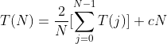

# 7 排序

## 7.1 插入排序
### 7.1.1 算法
最简单的排序算法之一是 **插入排序 (insertion sort)** 。插入排序由 N - 1 趟排序组成。对于 p = 1 到 N - 1 趟，插入排序保证从位置 0 到 位置 p 上的元素为已排序状态。插入排序利用了这样的事实：已知位置 0 到位置 p - 1 上的元素已经处于排过序的状态。

在第 p 趟，我们将位置 p 上的元素向左移动，直到它在前 p + 1 个元素中的正确位置被找到的地方。

```java
public static <E extends Comparable<? super E>> void insertionSort(E[] a) {
    int j;

    for (int p = 1; p < a.length; p++) {
        // 位置 p 上的元素存储于 tmp
        E tmp = a[p];
        // p 之前所有更大的元素都被向右移动一个位置
        for (j = p; j > 0 && tmp.compareTo(a[j - 1]) < 0; j--) {
            a[j] = a[j - 1];
        }
        // tmp 被置于正确的位置上
        a[j] = tmp;
    }
}
```

### 7.1.2 插入排序的分析
由于嵌套循环的每一个都花费 N 次迭代，因此插入排序为 O(N<sup>2</sup>)，而且这个界是精确的，因为以反序的输入可以达到该界。循环中元素的比较次数对于 p 的每个值最多是 p + 1 次。

如果输入的数据已预先排序，那么运行时间为 O(N)，因为内层 for 循环的检测总是立即判定不成立而终止。事实上，如果输入几乎被排序，那么插入排序将运行得很快。由于这种变化差别很大，因此值得我们去分析该算法平均情形的行为。实际上，和各种其他排序算法一样，插入排序的平均情形也是 O(N)。

## 7.2 一些简单排序算法的下界
成员是数的数组的逆序 (inversion) 即具有性质 i < j 但 a[i] > a[j] 的序偶(a[i]，a[j])。这正好是需要由插入排序 (隐含) 执行的交换次数。交换两个不按顺序排列的相邻元素恰好消除一个逆序，而一个排过序的数组没有逆序。由于算法中还有 O(N) 量的其他工作，因此插入排序的运行时间是 O(I + N) ，其中 I 为原始数组中的逆序数。于是，若逆序数是 O(N) ，插入排序以线性时间运行。

可以通过计算排列中的平均逆序数得出插入排序平均运行时间的精确的界。如往常一样，定义平均是一个困难的课题。假设不存在重复元素，输入数据是前 N 个整数的某个排列并设所有的排列都是等可能的。在上述假设下，可以得到以下定理：

* N 个互异数的数组的平均逆序数是 N * (N - 1) / 4
    * 意味着插入排序平均是二次的，同时也提供了只交换相邻元素的任何算法的一个很强的下界
* 通过交换相邻元素进行排序的任何算法平均都需要 O (N<sup>2</sup>) 时间。

下界告诉我们，为了使一个排序算法以亚二次或 O (N<sup>2</sup>) 时间运行，必须执行一些比较，特别是要对相距较远的元素进行交换。一个排序算法通过删除逆序得以向前进行，而为了有效地进行，它必须使每次交换删除不止一个逆序。

## 7.3 希尔排序
### 7.3.1 希尔排序的概念和实现
希尔排序 (Shellsort) 的名称源于它的发明者 Donald Shell，该算法是冲破二次时间屏障的第一批算法之一，不过直到它最初发现的若干年后才证明了它的亚二次时间界。它通过比较相距一定间隔的元素来工作；各趟比较所用的距离随着算法的进行而减少，直到只比较相邻元素的最后一趟排序位置。由于这个原因，希尔排序也被叫做 **缩减增量排序 (diminishing increment sort)** 。

希尔排序使用一个序列 h<sub>1</sub> ~ h<sub>t</sub>，叫做 **增量序列 (increment sequence)**。只要 h<sub>1</sub> = 1，任何增量序列都是可行的，不过有些增量序列比另一些效果更好。在使用增量 h<sub>k</sub> 的一趟排序之后，对于每一个 i 我们都有 a[i] ≤ a[i + h<sub>k</sub>]；所有相隔 h<sub>k</sub> 的元素都被排序。此时称文件是 h<sub>k</sub> 排序的 (h<sub>k</sub> - sorted)。希尔排序的一个重要性质是，一个 h<sub>k</sub> 排序的文件保持它的 h<sub>k</sub> 排序性。

h<sub>k</sub> 排序的一般做法是，对于 h<sub>k</sub> ~ N - 1 中每一个位置 i，把其上的元素放到 i，i - h<sub>k</sub>，i - 2h<sub>k</sub> ... 中的正确位置上。一趟 h<sub>k</sub> 排序的作用就是对 h<sub>k</sub> 个独立的子数组执行一次插入排序。

增量序列的一个流行的选择是使用 Shell 建议的序列：h<sub>t</sub> = [N / 2] 和 h<sub>k</sub> = [h<sub>k + 1</sub> / 2]。

```java
public static <E extends Comparable<? super E>> void shellsort(E[] a) {
    int j;

    for (int gap = a.length / 2; gap > 0; gap /= 2) {
        for (int i = gap; i < a.length; i++) {
            E tmp = a[i];
            for (j = i; j >= gap && tmp.compareTo(a[j - gap]) < 0; j -= gap) {
                a[j] = a[j - gap];
            }
            a[j] = tmp;
        }
    }
}
```

### 7.3.2 希尔排序的最坏情形分析
希尔排序编程简单，但是运行时间依赖于增量序列的选择。
* 使用希尔增量时希尔排序的最坏情形运行时间为 O(N<sup>2</sup>)
    * 选择 N 是 2 的幂，使得除了最后一个增量是 1 外所有的增量都是偶数。偶数位置上有 N/2 个同为最大是数，奇数位置上有 N/2 个同为最小的数。由于除了最后一个增量外所有的增量都是侯树，因此在进行最后一趟排序前，N/2 个最大的元素仍然在偶数位置上，N/2 个最小的元素也还是在奇数位置上。于是在最后一趟排序前，后一趟排序开始之前第 i 个最小的数在位置 2i - 1 上。将第 i 个元素恢复到其正确位置需要在数组中移动 i - 1 个间隔。这样仅仅将 N/2 个最小的元素放到正确的位置上就需要至少 O(N<sup>2</sup>) 的工作。
    * 希尔增量的问题在于，这些增量对未必是互素的，因此较小的增量可能影响很小。
* 使用 Hibbard 增量的希尔排序的最坏情形运行时间为 O(N<sup>3/2</sup>)
    * Hibbard 的增量形如 1、3、7 ... 2<sup>k</sup> - 1 。虽然正能量几乎相同，但关键的区别是相邻的增量没有公因子。

## 7.4 堆排序
### 7.4.1 堆排序的概念和实现
先前学习的优先队列可以用于以 O(N log N) 时间的排序。基于该思想的算法叫做堆排序 (heapsort) ，它给出了我们至今所见到的最佳的大 O 的运行时间。

回忆建立 N 个元素的二叉堆的基本策略，这个阶段花费 O(N) 时间。然后我们执行 N 次 deletemin 操作。按照顺序，最小的元素先离开堆。通过将这些元素记录到第二个数组然后再将数组拷贝回来，得到 N 个元素的排序。由于每个 deleteMin 花费时间 O(log N) ，因此总的运行时间是 O(N log N)。

该算法的主要问题在于它使用了一个附加数组。因此，存储需求增加一倍。在某些实例中可能是个问题。注意，将第二个数组拷贝回第一个数组的附加时间消耗只是 O(N)，这不可能显著影响运行时间。这里的问题是空间的问题。

回避使用第二个数组的聪明的方法是利用这样的事实：在每次 deleteMin 之后，堆缩小 1 。因此，位于堆中最后的单元可以用来存放刚刚删去的元素。使用这种策略，在最后一次 deleteMin 后，该数组将以递减的顺序包含这些元素。如果我们想要这些元素排成更典型的递增顺序，那么可以改变有序的特性使得父亲的关键字的值大于儿子的关键字的值。这样就得到 (max) 堆。

在我们的实现方法中将使用一个 (max) 堆，但由于速度的原因避免了实际的 ADT。照通常的习惯，每件事都是在数组中完成的。第一步以线性时间建立一个堆；然后通过每次将堆中的最后元素与第一个元素交换，执行 N - 1 次 deleteMin 操作，每次将堆的大小缩减 1 并进行下滤；当算法终止时，数组则以排好的顺序包含这些元素。

```java
private static int leftChild(int i) {
        return 2 * i + 1;
    }

private static <E extends Comparable<? super E>> void percDown(E[] a, int i, int n) {
    int child;
    E tmp;

    for (tmp = a[i]; leftChild(i) < n; i = child) {
        child = leftChild(i);
        if (child != n - 1 && a[child].compareTo(a[child + 1]) < 0)
            child++;
        if (tmp.compareTo(a[child]) < 0)
            a[i] = a[child];
        else
            break;
    }
    a[i] = tmp;
}

public static <E extends Comparable<? super E>> void swapReferences(E[] a, int left, int right) {
    E temp;
    temp = a[left];
    a[left] = a[right];
    a[right] = temp;
}

public static <E extends Comparable<? super E>> void heapsort(E[] a) {
    for (int i = a.length / 2 - 1; i >= 0; i--)
        percDown(a, i, a.length);
    for (int i = a.length - 1; i > 0; i--) {
        swapReferences(a, 0, i);
        percDown(a, 0, i);
    }
}
```

### 7.4.2 堆排序的分析
第一阶段构建堆最多用到 2N 次比较；在第二阶段，第 i 次 deleteMin 最多用到 2 [log i] 次比较，总数最多 2N logN - O(N) 次比较 (设 N ≥ 2)。因此，在最坏的情形下堆排序最多使用 2N logN - O(N) 次比较。

经验表明，堆排序是一个非常稳定的算法：它使用的比较平均只比最坏情形指出的略少。多年来，还没有人能够指出堆排序平均运行时间的非平凡界。似乎问题在于连续的 deleteMin 操作破坏了堆的随机性，使得概率论证非常复杂。

## 7.5 归并排序
### 7.5.1 归并排序的概念和实现
归并排序 (mergesort) 以 O(N log N) 最坏情形时间运行，而且所使用的比较次数几乎是最优的。它是递归算法一个好的实例。

这个算法中基本的操作是合并两个已排序的表。因为这两个表是已排序的，所以若将输出放到第三个表中，则该算法可以通过对输入数据一趟排序来完成。基本的合并算法是取两个输入数组 A 和 B，一个输出数组 C，以及三个计数器 Actr、Bctr、Cctr，它们初始置于对应数组的开始端。A[Actr] 和 B[Bctr] 中的较小者被拷贝到 C 中的下一个位置，相关的计数器向前推进一步。当两个输入表有一个用完的时候，将另一个表中剩余部分拷贝到 C 中。

合并两个已排序的表的时间显然是线性的，因为最多进行 N - 1 次比较，其中 N 是元素的总数。为了看清这一点，注意每次比较都把一个元素添加到 C 中，但最后的比较除外，它至少添加两个元素。

因此，归并排序算法很容易描述。如果 N = 1 ，那么只有一个元素需要排序，答案是显然的。否则递归地将前半部分数据和后半部分数据各自归并排序，得到排序后的两部分数据，然后使用上面描述的合并算法再将这两部分合并到一起。该算法是经典的分治 (divide - and - conquer) 策略，它将问题分 (divide) 成一些小的问题然后递归求解，而治 (conquer) 的阶段则将分的阶段解得的各答案修补在一起。分而治之是递归非常有效的用法。

```java
private static <E extends Comparable<? super E>> void mergeSort(E[] a, E[] tmpArray, int left, int right) {
    if (left < right) {
        int center = (left + right) / 2;
        mergeSort(a, tmpArray, left, center);
        mergeSort(a, tmpArray, center + 1, right);
        merge(a, tmpArray, left, center + 1, right);
    }
}

public static <E extends Comparable<? super E>> void mergeSort(E[] a) {
    E[] tmpArray = (E[]) new Comparable[a.length];
    mergeSort(a, tmpArray, 0, a.length - 1);
}

/**
 * 如果对 merge 的每个递归调用均局部声明一个临时数组，那么在任一时刻就可能有 log N 个临时数组处在活动期
 * 由于 merge 是 mergeSort 的最后一行，因此在任一时刻只需要一个临时数组在活动，我们还可以使用该临时数组的任意部分
 */
private static <E extends Comparable<? super E>> void merge(E[] a, E[] tmpArray, int leftPos, int rightPos, int rightEnd) {
    int leftEnd = rightPos - 1;
    int tmpPos = leftPos;
    int numElements = rightEnd - leftPos + 1;

    while (leftPos <= leftEnd && rightPos <= rightEnd)
        if (a[leftPos].compareTo(a[rightPos]) <= 0)
            tmpArray[tmpPos++] = a[leftPos++];
        else
            tmpArray[tmpPos++] = a[rightPos++];

    while (leftPos <= leftEnd)
        tmpArray[tmpPos++] = a[leftPos++];

    while (rightPos <= rightEnd)
        tmpArray[tmpPos++] = a[rightPos++];

    for (int i = 0; i < numElements; i++, rightEnd--) {
        a[rightEnd] = tmpArray[rightEnd];
    }
}
```

### 7.5.2 归并排序的分析
归并排序是用于分析递归例程技巧的经典实例：我们必须为运行时间写出一个递归关系。对于 N 个数归并排序的用时等于完成两个大小为 N/2 的递归排序所用的时间再加上合并的时间，即：T (N) = 2 * T(N/2) + N (其中，T(1) = 1)。计算可得时间复杂度为 O(N log N)。

虽然归并排序的运行时间是 O(N log N) ，但是它有一个明显的问题，即合并两个已排序的表用到线性附加内存。在整个算法中还要花费将数据拷贝到临时数组再拷贝回来这样一个附加的工作，它明显减慢了排序的速度。这种拷贝可以通过在递归的那些交替层次上审慎地交换 a 和 tmpArray 的角色得以避免。归并排序的一种变形也可以非递归地实现，

与其他的 O(N log N) 排序算法比较，归并排序的运行时间严重依赖于比较元素和在数组 (以及临时数组) 中移动元素的相对开销。

## 7.6 快速排序
### 7.6.1 快速排序的概念和简单实现
快速排序 (quicksort) 是实践中的一种快速的排序算法，它的平均运行时间是 O(N log N) 。该算法之所以特别快，主要是由于非常精炼和高度优化的内部循环。它的最坏情形性能为 O(N<sup>2</sup>) ，但经过稍许努力可使这种情形极难出现。通过将快速排序和堆排序结合，由于堆排序的 O(N log N) 最坏情形运行时间，我们可以对几乎所有的输入都能达到快速排序的快速运行时间。

虽然多年来快速排序算法曾被认为是理论上高度优化而在时间中不可能正确编程的一种算法，但是如今该算法简单易懂并且被证明是正确的。像归并排序一样，快速排序也是一种分治的递归算法。

```java
// 简单的递归排序算法
public static void sort(List<Integer> items) {
    if (items.size() > 1) {
        List<Integer> smaller = new ArrayList<>();
        List<Integer> same = new ArrayList<>();
        List<Integer> larger = new ArrayList<>();

        Integer chosenItem = items.get(items.size() / 2);
        for (Integer i : items) {
            if (i < chosenItem)
                smaller.add(i);
            else if (i > chosenItem)
                larger.add(i);
            else
                same.add(i);
        }

        sort(smaller);
        sort(larger);

        items.clear();
        items.addAll(smaller);
        items.addAll(same);
        items.addAll(larger);
    }
}
```

上述算法形成了快速排序的基础，然而它会产生额外的列表，并且还是递归地这么做，我们很难看到这比归并排序进步了多少。为了做得更好，我们必须避免使用大量额外的内存，并且有干净的内循环。于是快速排序通常应避免建立第二组 (包含等于项的)，并且该算法还有很多微妙的细节会影响到效率，所以才这么复杂。

下面描述最常用的快速排序的实现 —— “经典快速排序”，其中输入存放在数组里，且算法不产生额外的数组。

**将数组 S 排序的基本算法由下列简单的四步组成：**
1. 如果 S 中元素个数是 0 或 1 ，则返回
2. 取 S 中任一元素 v ，称之为 **枢纽元(pivot)**
3. 将 S - {v} (S 中其余元素) 划分成两个不相交的集合：S<sub>1</sub> = {x ∈ S - {v} |x ≤ v} 和 S<sub>2</sub> = {x ∈ S - {v} |x ≥ v}
4. 返回 { quicksort(S<sub>1</sub>) 后跟 v，继而返回 quicksort(S<sub>2</sub>) } 

由于对那些等于枢纽元的元素的处理上，第 3 步分割的描述不是唯一的，因此这就成了一种设计决策。一部分的实现方法是将这种情况尽可能有效地处理。直观地看，我们希望把等于枢纽元的大约一半的关键字分到 S<sub>1</sub> 中，而另外的一半分到 S<sub>2</sub> 中，很像我们希望二叉查找树保持平衡的情形。

如同归并排序那样，快速排序递归地解决两个子问题并需要线性的附加工作 (第 3 步) ，不过与归并排序不同，这两个子问题并不保证具有相等的大小，这是个潜在的隐患。快速排序更快的原因在于，第 3 步分割成两组实际上是在适当的位置进行并且非常有效，它的高效不仅可以弥补大小不等的递归调用的不足而且还能有所超出。

### 7.6.2 选取枢纽元
#### 7.6.2.1 一种错误的方法
通常的、无知的选择是将第一个元素用作枢纽元。如果输入是随机的，那么这是可以接受的，而如果输入是预排序的或是反序的，那么这样的枢纽元就产生一个劣质的分割，因为所有的元素不是都被划入 S<sub>1</sub> 就是都被划入 S<sub>2</sub> 。更糟糕的是，这种情况毫无例外地发生在所有的递归调用中。实际上，如果第一个元素用作枢纽元而且输入是预先排序的，那么快速排序花费的时间将是二次的，可是实际上却根本没干什么事，这是相当尴尬的。而且，预排序的输入是相当常见的，因此，使用第一个元素作为枢纽元是绝对可怕的坏主意。另一种想法是选取前两个互异的关键字中的较大者作为枢纽元，不过这和只选取第一个元素作为枢纽元具有相同的害处。 

#### 7.6.2.2 一种安全的方法
一种安全的方针是随机选取枢纽元。一般来说这种策略非常安全，除非随机数发生器有问题，因为随机的枢纽元不可能总在接连不断地产生劣质的分割；另一方面，随机数的生成一般开销很大，根本减少不了算法其余部分的平均运行时间。

#### 7.6.2.3 三数中值分割法 (Median - of - Three Partitioning)
一组 N 个数的中值 (也叫做中位数) 是第 [N / 2] 个最大的数。枢纽元的最好的选择是数组的中值。不幸的是，这很难算出并且会明显减慢快速排序的速度。这样的中值的估计量可以通过随机选取三个元素并用它们的中值作为枢纽元而得到。事实上，随机性并没有多大的帮助，因此一般的做法是使用左端、右端和中心位置上的三个元素的中值作为枢纽元。显然使用三数中值分割法消除了预排序输入的坏情况。

### 7.6.3 分割策略
有几种分割策略用于实践，而此处描述的分割策略已被证明能够给出好的结果。我们将会看到，分割是一种很容易出错或低效的操作，但使用一种已知方法是安全的。该法的第一步是通过将枢纽元与最后的元素交换使得枢纽元离开要被分割的数据段。i 从第一个元素开始而 j 从倒数第二个元素开始。

当 i 在 j 的左边时，我们将 i 右移，移过那些小于枢纽元的元素，并将 j 左移，移过那些大于枢纽元的元素。当 i 和 j 停止时，i 指向一个大元素而 j 指向一个小元素。如果 i 在 j 的左边，那么将这两个元素交换，其效果是把一个大元素推向右边而把一个小元素推向左边；然后我们交换由 i 和 j 指向的元素，重复该过程直到 i 和 j 彼此交换为止；分割的最后一步是将枢纽元与 i 所指向的元素交换。

在最后一步当枢纽元与 i 所指向的元素交换时，我们知道在位置 p < i 的每一个元素都必然还是小元素，这是因为或者位置 p 包含一个从它开始移动的小元素，或者位置 p 上原来的大元素在交换期间被置换了。类似的论断指出，在位置 p > i 上的元素必然都是大元素。

我们必须考虑的一个重要的细节是如何处理那些等枢纽元的元素。问题在于当 i 遇到一个等于枢纽元的元素时是否应该停止，以及当 j 遇到一个等于枢纽元的元素时是否应该停止。直观地看，i 和 j 应该做相同的工作，否则分割将出现偏向一方的倾向。

为了明确一种更好的办法，我们考虑数组中所有的元素都相等的情况。如果 i 和 j 都停止，那么在相等的元素间将有很多次交换。虽然这似乎没什么意义，但是其正面的效果则是 i 和 j 将在中间交错，因此当枢纽元被替代时，这种分割建立了两个几乎相等子数组。归并排序的分析告诉我们，此时总的运行时间为 O(N log N)。

如果 i 和 j 都不停止，那么就应该有相应的程序防止 i 和 j 越出数组的端点，不进行交换的操作。虽然这样似乎不错，但是正确的实现方法却要把枢纽元交换到 i 最后到过的位置，这个位置是倒数第二个位置 (或最后的位置，这依赖于精确的实现)。这样的做法将会产生两个非常不均衡的子数组。如果所有的关键字都是相同的，那么运行时间则是 O(N<sup>2</sup>) 。对于预排序的输入而言，其效果与使用第一个元素作为枢纽元相同。它花费的时间是二次的可是却什么事也没干。

这样我们就发现，进行不必要的交换建立两个均衡的子数组要比蛮干冒险得到两个不均衡的子数组好。因此，如果 i 和 j 遇到等于枢纽元的关键字，那么我们就让 i 和 j 都停止。对于这种输入，这实际上是四种可能性中唯一的一种不花费二次时间的可能。

### 7.6.4 小数组
对于很小的数组 (N ≤ 20)，快速排序不如插入排序。不仅如此，因为快速排序是递归的，所以这样的情形经常发生。通常的解决方法是对于小的数组不使用递归的快速排序，取而代之诸如插入排序这样的对小数组有效的排序算法。使用这种策略实际上可以节省大约 15% (相对于不要截止的做法而自始至终使用快速排序时) 的运行时间。一种好的截止范围 (cutoff range) 是 N = 10，虽然在 5 到 20 之间任一截止范围都有可能产生类似的结果。这种做法也避免了一些有害的退化情形，如取三个元素的中值而实际上却只有一个或两个元素的情况。

### 7.6.5 实际的快速排序例程
```java
public static <E extends Comparable<? super E>> void quicksort(E[] a) {
    quicksort(a, 0, a.length - 1);
}

public static <E extends Comparable<? super E>> void swapReferences(E[] a, int left, int right) {
    E p;
    p = a[left];
    a[left] = a[right];
    a[right] = p;
}

private static <E extends Comparable<? super E>> E median3(E[] a, int left, int right) {
    int center = (left + right) / 2;
    if (a[center].compareTo(a[left]) < 0)
        swapReferences(a, left, center);
    if (a[right].compareTo(a[left]) < 0)
        swapReferences(a, left, right);
    if (a[right].compareTo(a[center]) < 0)
        swapReferences(a, center, right);

    // Place pivot at position right - 1
    swapReferences(a, center, right - 1);
    return a[right - 1];
}

private static <E extends Comparable<? super E>> void quicksort(E[] a, int left, int right) {
    if (left + CUTOFF <= right) {
        E pivot = median3(a, left, right);

        // Begin partitioning
        // 初始化为比他们正确值超过 1 个位置，使得不存在特殊情况需要考虑
        int i = left, j = right - 1;
        for (; ; ) {
            while (a[++i].compareTo(pivot) < 0) {}
            while (a[--j].compareTo(pivot) > 0) {}
            if (i < j)
                swapReferences(a, i, j);
            else
                break;
        }

        /*
        // 不能这样写
        // 若 a[i] = a[j] = pivot 会产生一个无限循环
        int i = left + 1, j = right - 2;
        for (; ; ) {
            while (a[i].compareTo(pivot) < 0) { i++; }
            while (a[j].compareTo(pivot) > 0) { j--; }
            if (i < j)
                swapReferences(a, i, j);
            else
                break;
        }
        */

        // Restore piovt
        swapReferences(a, i, right - 1);

        // Sort small elements
        quicksort(a, left, i - 1);
        // Sort large elements
        quicksort(a, i + 1, right);
    } else
        // Do an insertion sort on the subarray
        insertionSort(a, left, right);
}
```

### 7.6.6 快速排序的分析
正如归并排序那样，快速排序也是递归的，因此它的分析需要求解一个递归公式。我们将对快速排序进行这种分析。假设有一个随机的枢纽元 (不用三数中值分割法) 并对一些小的文件不设截止范围。和归并排序一样，取 T(0) = T(1) = 1，快速排序的运行时间等于两个递归调用的运行时间加上花费的分割上的线性时间 (枢纽元的选取仅花费常数时间)。我们得到基本的快速排序关系：T(N) = T(i) + T(N - i - 1) +cN。(其中，i = |S<sub>1</sub>| 是 S<sub>1</sub> 中元素的个数)

#### 最坏情况的分析
枢纽元始终是最小元素。此时 i = 0，如果我们忽略无关紧要的 T(0) = 1，将递归方程相加可以得到：T(N) = O(N<sup>2</sup>)。

#### 最好情况的分析
在最好的情况下，枢纽元正好处于中间。为了简化数学推导，我们假设两个子数组恰好各位原数组的一半大小，虽然这回给出稍微过高的估计，但是由于我们只关心大 O 答案，因此结果还是可以接受的：T(N) = 2T(N / 2) + cN。于是 T(N) = cN log N + N = O(N log N)。

#### 平均情况的分析


化简、相加、计算可得 T(N) = cN log N + N = O(N log N) 

### 7.6.7 选择问题的线性期望时间算法
由于我们能够以 O (N log N) 时间给数组排序，因此可以期望为选择问题得到一个更好的时间界。将这种算法称之为快速选择，步骤如下：(令 |S<sub>i</sub>| 为 S<sub>i</sub> 中元素的个数)

1. 如果 |S| = 1，那么 k = 1 并将 S 中的元素作为答案返回。如果正在使用小数组的截止方法且 |S| < CUTOFF，则将 S 排序并返回第 k 个最小元素
2. 选取一个枢纽元 v ∈ S
3. 将集合 S - {v} 分割成 S<sub>1</sub> 和 S<sub>2</sub>,
4. 如果 k ≤ |S<sub>1</sub>|，那么第 k 个最小元必然在 S<sub>1</sub> 中，在这种情况下返回 quickselect(S<sub>1</sub>，k)；如果 k = 1 + |S<sub>1</sub>|，那么枢纽元就是第 k 个最小元，我们将它作为答案返回；否则，第 k 个最小元就在 S<sub>2</sub> 中，它是 S<sub>2</sub> 中的第 (k - |S<sub>1</sub>| - 1) 个最小元，我们进行一次递归调用并返回 quickselect(S<sub>2</sub>，k - |S<sub>1</sub>| - 1)。

与快速排序相比，快速选择只做一次递归调用而不是两次。快速选择的最坏情况和快速排序的相同，也是 O(N<sup>2</sup>) 。直观看来，这是因为快速排序的最坏情况是在 S<sub>1</sub> 和 S<sub>2</sub> 有一个是空的时候的情况；于是快速排序就不是真的节省一次递归调用。不过平均运行时间是 O(N)。

快速选择的例程如下：

```java
private static <E extends Comparable<? super E>> void quickSelect(E[] a, int left, int right, int k) {
    if (left + CUTOFF <= right) {
        E pivot = median3(a, left, right);

        int i = left, j = right - 1;
        for (; ; ) {
            while (a[++i].compareTo(pivot) < 0) {}
            while (a[--j].compareTo(pivot) > 0) {}
            if (i < j)
                swapReferences(a, i, j);
            else
                break;
        }

        swapReferences(a, i, right - 1);

        if (k <= i)
            quickSelect(a, left, i - 1, k);
        else if (k > i + 1)
            quickSelect(a, i + 1, right, k);
    } else
        insertionSort(a, left, right);
}
```

当算法终止时，第 k 个最小元就在位置 k - 1 上 (因为数组开始于下标 0)。这破坏了原来的排序，如果不希望这样就必须做一份拷贝。

使用三数中值选取枢纽元的方法使得最坏情况发生的机会几乎是微不足道的。然而，通过仔细选择枢纽元，我们可以消除二次的最坏情况而保证算法是 O(N) 的。可是这么做的额外开销是相当大的，因此最终的算法主要在于理论上的意义。
 
